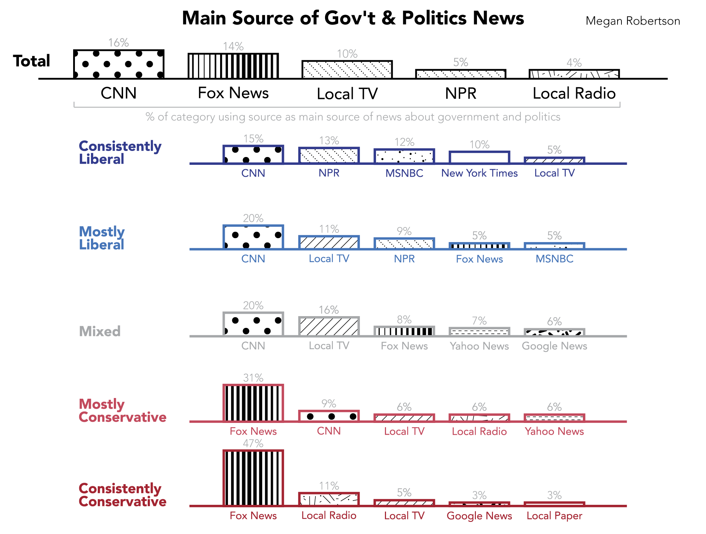

class: center, middle

# Assignment 1

### Visualization Redesign

---
class: left, top
background-image: url(http://www.journalism.org/files/2014/10/PJ_14.10.21_mediaPolarization-00.png)  

---
class: left, top

### Tables
.width3[]
.width3[]
.width3[]

---
.width2[]
.width2[]

Nicole Kim  

> The original chart is tough to see how the popularity compares across the ideological groups. To improve this chart, I use the rows differently, so that instead of arranging by rank, I give each outlet it’s own row. I also use different colors to make each row can relative, showing how many outlets there are in total as well.

---
background-image: url(Table/386994-801233.jpg)

---
Nicole Kim

> The original chart is tough to see how the popularity compares across the ideological groups. To improve this chart, I use the rows differently, so that instead of arranging by rank, I give each outlet it’s own row. I also use different colors to make each row can relative, showing how many outlets there are in total as well.  

---
background-image: url(Table/238574-801233.jpg)

---
background-image: url(Table/c-381135-801233.jpg)

---
### Small Multiples

.width4[]
.width4[]
.width4[]  

.width4[]
.width4[]
.width4[]

---
background-image: url(Multiples/a-326102-801233.jpg)

---
background-image: url(Multiples/b-236472-801233.png)

---
background-image: url(Multiples/c-316029-801233.jpg)

---
background-image: url(Multiples/d-237709-801233.png)

---
background-image: url(Multiples/e-405940-801233.png)

---
background-image: url(Multiples/f-240118-801233.png)

---
### Clustered Bar Charts

.width4[]
.width4[]
.width4[]
.width4[]

---
background-image: url(ClusteredBar/a-243207-801233.png)

---
background-image: url(ClusteredBar/b-226378-801233.png)

---
background-image: url(ClusteredBar/c-226137-801233.png)

---
background-image: url(ClusteredBar/d-230371-801233.png)

---
### Stacked Bar Charts

.width3[]
.width3[]
.width3[]
.width3[]

---
background-image: url(StackedBar/a-226447-801233.png)

---
background-image: url(StackedBar/b-244303-801233.jpg)

---
background-image: url(StackedBar/c-244397-801233.png)

---
background-image: url(StackedBar/d-234337-801233.png)
