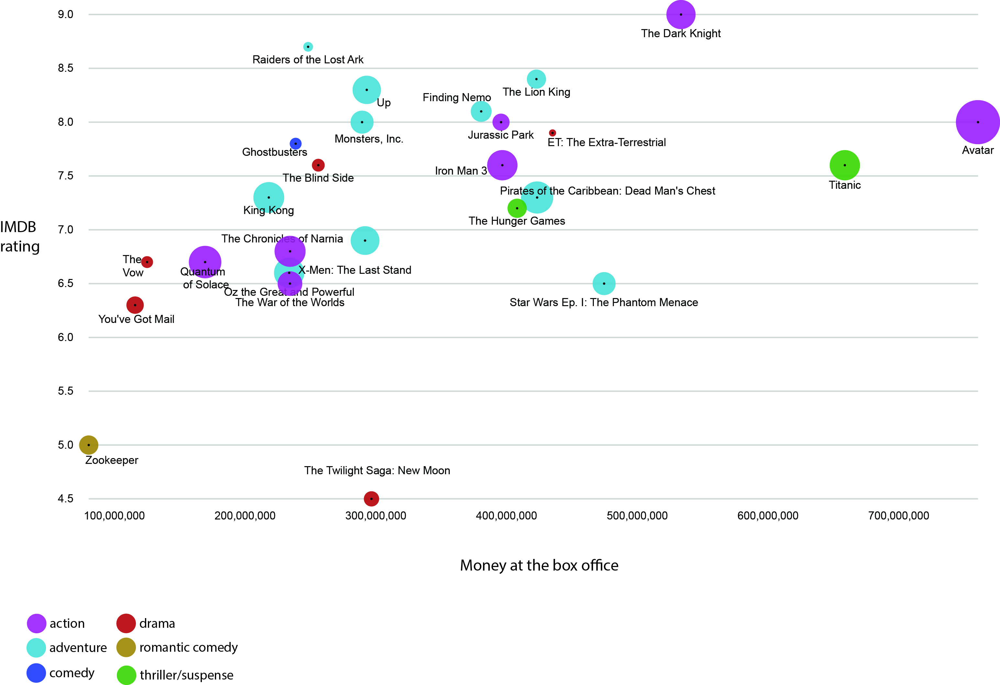



### Ella Ferguson  

Assignment 2  

Data: [Raw Movie Dataset]

 [Process Notebook]

(a2-Ferguson.pdf) 

 ---  
 
 

IMDB ratings vs Box Office Totals

.  --- 

This graph shows the correlation between box office totals and IMDB ratings. Usually, the higher the box office total, the higher the rating on IMDB is.  It does show that a few movies had lower ratings even though they had large box office returns.

