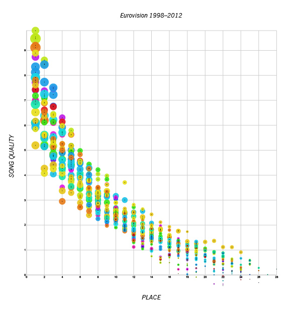

### Gerda Mostonaite

Assignment 2

Data: [here](https://public.tableau.com/s/resources?qt-overview_resources=1https://public.tableau.com/s/resources?qt-overview_resources=1)  
or name of built-in dataset

[Process Notebook](a2-Mostonaite.pdf)

---

This plot shows the relationship between where countries placed in Eurovision compared to the “Estimated Song Quality” score. The size of the bubble indicates how many points were received and the colour shows the year.

---

Final Question: Do the better quality songs always place higher? 
Findings: While it seems the winners generally have the better quality songs, there are some with higher quality scores that placed lower in the competition. 
However, the major finding was that the data was incorrect. Many countries were listed multiple times per year and received different scores. It also listed multiple winners for several different years.