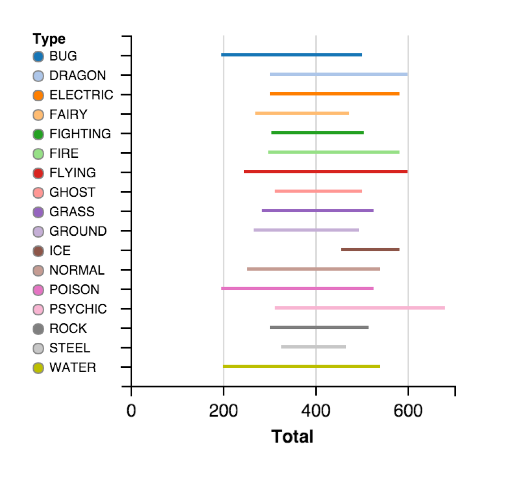

### Juweek Adolphe

Assignment 2

Data: [pokemon.csv](pokemon.csv) (link broken)

[Process Notebook](a2-adolphe.pdf)

.width4[]

*Range of base stats for each pokemon type*  

After looking at the data, it is shown clearly that psychic type seem to be the overall strongest, for the end of their range is the highest out of all the types. Ice types seem to have the lowest standard deviation for its line is quite short. This chart shows that the strongest pokemon in the game is a psychic type pokemon, while the absolute weakest pokemon are both poison and bug.