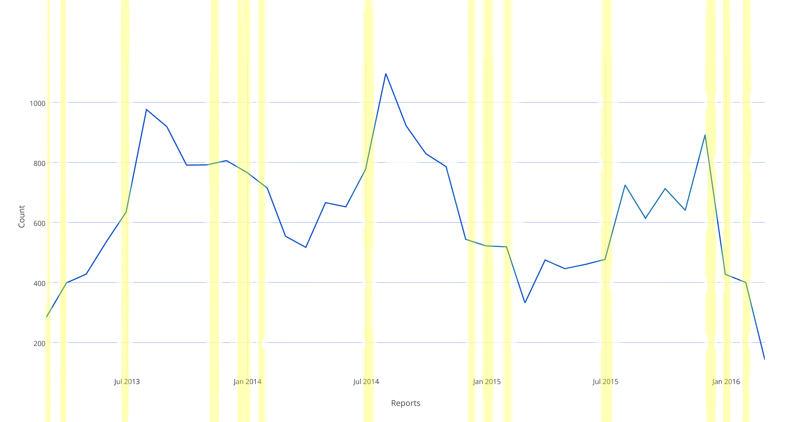

### Kaitlin Eddy

Assignment 2

Data: [here](https://www.quandl.com/data/NUFORC/SIGHTINGS-UFO-Sightings)  

[Process Notebook](a2-eddy.pdf)

---

UFO Sightings and Major Holidays with Fireworks

---

The visualization is showing 3 years of data, plotting it month by month. The X axis shows the frequency of reports of UFO sightings in the United States, and the  Y axis shows the dates. The yellow colored bars show the times with the most fireworks across the United States.