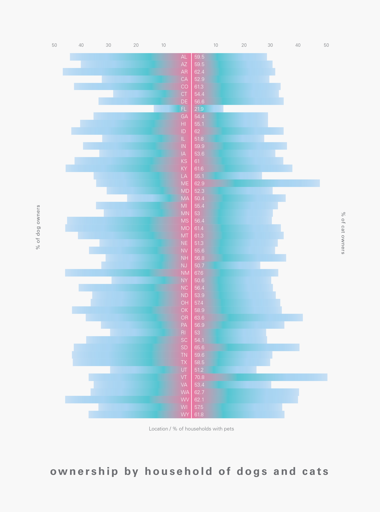

### Lansing Cai

Assignment 2

Data: [here](https://public.tableau.com/s/sites/default/files/media/EMSI_MillenialsvsBabyBoomers.xls)

[Process Notebook](a2-Cai.pdf)

---

---

This graph shows a comparison of the most popular occupations for Baby Boomers and Millennials from 2007-2013, and which occupations increased in popularity and decreased in popularity for each generation. This graph also shows the fields that most people are employed in, whether or not they belong to a specific generation. The top 3 occupations that showed an increase in growth in Baby Boomers were Healthcare Support (26%), Healthcare Practitioners and Technical (22%), and tied between Computer & Mathematical (20%) and Food Prep & Serving Related (20%). The top 3 occupations that showed an increase in growth in Millennials were Food Prep (18%), Healthcare Support (16%), and Personal Care & Service (14%). The common trend from 2007-2013 between the two generations is an increase in Healthcare jobs. 

---

### Ella Ferguson  

Assignment 2  

Data: [Raw Movie Dataset]

[Process Notebook](a2-Ferguson.pdf) 

 ---  
 
 

IMDB ratings vs Box Office Totals

--- 

This graph shows the correlation between box office totals and IMDB ratings. Usually, the higher the box office total, the higher the rating on IMDB is.  It does show that a few movies had lower ratings even though they had large box office returns.

---

### Betty Huynh

Assignment 2

Data:[here](https://public.tableau.com/s/sites/default/files/media/HollywoodsMostProfitableStories.csv)  

[Process Notebook](a2-Huynh.pdf)

---



Hollywood movies making records from 2007 to 2011. 

---

Emphasized in black, the graph shows the total number of records that were made each year. Each year’s total amount is then broken down into the six main genres. Each genre is color-coded according to the type of feeling each one emits. 
  

---

### Gerda Mostonaite

Assignment 2

Data: [here](https://public.tableau.com/s/resources?qt-overview_resources=1https://public.tableau.com/s/resources?qt-overview_resources=1)  
or name of built-in dataset

[Process Notebook](a2-Mostonaite.pdf)

---

This plot shows the relationship between where countries placed in Eurovision compared to the "Estimated Song Quality" score. The size of the bubble indicates how many points were received and the colour shows the year.

---

Final Question: Do the better quality songs always place higher? 
Findings: While it seems the winners generally have the better quality songs, there are some with higher quality scores that placed lower in the competition.  

However, the major finding was that the data was incorrect. Many countries were listed multiple times per year and received different scores. It also listed multiple winners for several different years.

---

Megan Robertson

Assignment 2

Data: Cocktails (correlations) [here](http://app.raw.densitydesign.org)

[Process Notebook](a2-Robertson.pdf)

---



Popular cocktails broken down by the proportion of their ingredients.

---

A majority of the most popular cocktails use only three ingredients. No matter how inexperienced with mixed drinks one might be, the simplicity of only three ingredients for most cocktails (with the glaring exception of the Long Island Iced Tea) presents beer aficionados with a wonderfully simple task to undertake. In fact, only two of the twenty cocktails in the data used more than three ingredients. Now the only question is... shaken or stirred?


---

### Teressa Ross 

Assignment 2

Data: Titanic [here](http://www.tableau.com/public/community/sample-data-sets)

[Process Notebook](a2-Ross.pdf)

--- 

The Titanic the night of its sinking held a total of 2,223 passengers and of those 1,517 died. This data represents 1309 of those passengers and the survivors within each class. 

--- 

I wanted the data to reflect how the numbers  decrease as you discover how many passengers actually survived. The pie chart is more representative of the data in percents if that’s what you prefer. I had a little difficulty in thinking of a way to convey a percent within the percent without it looking like another piece of the pie. Also knowing how pie charts are not the easiest to read always I proceeded to do a bar graph.  The bar graph does a good job in visually displaying the data as it decreases from the total of passengers, to the total passengers within the class, and then the total of survivors within that class in an easier format.  The colors are reflective of the class and how it ascends as well for both. For the bar graphs i felt the second one is more impactful when the total is combined. It looms reminding you how many passengers are in this dataset. 

---

Initially I wanted a pie chart because I was going to solve this problem from a percentage perspective. This mostly was for the fact that from the data, of the 1309 passengers 24.7%  were from first class (323 passengers), for the second class 21.1% (277passengers), and for third class 54.2% (709 passengers).  Then from these percents you derive to the percent who survived. For first class 61.9% of the 323 passengers survived (200 passengers) , for second class 42.9% of the 277 passengers survived (119 passengers), and lastly for third class 25.5% of the 709 passengers
survived (181 passengers). 

--- 

Seeing as pie charts are hard to read sometimes I proceeded to a bar chart that visually displays the totals within the totals just considering the passengers. The data in the bar chart is the same data as stated above without the percents. The data revealed a number of things. First that there is a connection between class and survivor rate. The higher the class the higher the survivor numbers with first class having a littl well over half of there passengers surviving. Second class almost had have of their class surviving with third class at about 25%.  I didn’t know or expect that the data to show that the second class had lower numbers than first class and for the third class to be so big in total. The only expectations I had concerned a whole different variable gender (with women having the highest survival numbers).  In conclusion very interesting dataset and if I were to proceed I think I would add age as a variable.  

---

### Kaitlin Eddy

Assignment 2

Data: [here](https://www.quandl.com/data/NUFORC/SIGHTINGS-UFO-Sightings)  

[Process Notebook](a2-eddy.pdf)

---

UFO Sightings and Major Holidays with Fireworks

---

The visualization is showing 3 years of data, plotting it month by month. The X axis shows the frequency of reports of UFO sightings in the United States, and the  Y axis shows the dates. The yellow colored bars show the times with the most fireworks across the United States.

---

### Chelsea Jay

Assignment 2

Data: movies [here](http://vega.github.io/voyager/)

[Process Notebook](a2-jay.pdf)

---



DVD sales decrease as MPAA rating increase.

---

The inital question that was raised when reviewing data was if DVD sales were either impacted or not by DVD MPAA rating. Through research and inserting different data, I narrowed it down to these data sets. When looking at this visual, one can deduce that as US movie genre’s increase in MPAA ratings, US DVD sales decrease. I wonder if Directors should start rethinking things when approaching the big screen.

---

### Nicole Kim

Assignment 2

Data: [Tableau](https://public.tableau.com/s/resources?qt-overview_resources=1)

Tool: [Voyager and Illustrator]

[Process Notebook](a2-kim.pdf)

---



Ownership by household of dogs and cats

---

The dataset is about Percentage of Households with Pets that broken down state via American Veterinary Medical Association. 

- Percentage of Cats VS Percentage of Dogs
- Percentage of Dog and Cat Owners VS Percentage of Pet Households in Different States

Results are drawn from a survey of more than 60,000 households in the United States.  

--- 

By the graph, six-out-of-ten pet owners, or 63.2%, considered their pets to be family members. One thing that they track are rates of cat and dog ownership among different states. Top ten pet-owning states are Vermont (70.8%), New Mexico (67.6%), South Dakota (65.6%), Oregon (63.6%), Maine (62.9%), Washington (62.7%), Arkansas (62.4%), West Virginia (62.1%), Idaho (62%) and Wyoming (61.8%) in order. The state of Arkansas has the highest percentage of households that own a dog (47.9%) and Vermont the highest that own a cat (49.5%). In contrast, the state of Illinois has the lowest percentage of households that own a dog (32.4%) and California the lowest that own a cat (28.3%). New York and Delaware are evenly split: in New York, 29% of households own cats, and about the same proportion own dogs, and in Delaware, cat owning and dog owning households are tied at about 33.7% each. The South is much more favorable to dogs than to cats. In Arkansas, 48% of households own dogs, but just 31% own cats. One final observation is that neither cats nor dogs are overly common in Washington, DC. Only 13% of households in the capital own dogs, and just 12% own cats.

---

### Leah Lukens

Assignment 2

Data: [here](https://public.tableau.com/s/resources?qt-overview_resources=1)  

[Process Notebook](a2-lukens.pdf)

---

Offensive first round draft picks from SEC football teams between 1999-2013.

---

The data shown describes football teams from the Southeastern Conference (SEC) of the National Collegiate Athletic Association (NCAA) in relation to their players being chosen in the National Football League (NFL) draft. The visualization specifically shows how many first round draft picks each SEC team has had between 1999-2013. Players chosen in the first round of the NFL draft are show the most talent while playing in the NCAA as well as the most promise of being successful playing in the NFL. This data includes both Texas A & M University and The University of Missouri, even though they joined the Southeastern Conference in 2012; the data reflects only their NFL draft picks from their time in the Southeastern Conference. 

---

### Laura Elizabeth Martin

Assignment 2

Data: [here](http://vincentarelbundock.github.io/Rdatasets/csv/datasets/warpbreaks.csv)  

[Process Notebook](a2-martin.pdf)

---

Relationship of wool type and tension to the amount of breaks in weaving.

---

This graphic shows the relationship between wool type and tension to the amount of breaks in weaving. It not only shows the combinations of wool and tension, but breaks down further to show which wool or tension setting alone produces the most breaks, regardless of the other.

---

### Ariel Lockshaw

Assignment #2

Data: [here](public.surfrider.org/files/surfrider_report_v13.pdf)

[Proess Notebook](a2-Lockshaw.pdf)

---



2009 California Surf Break Demographic Comparison

---

The surfers that responded to the surveys earn in the middle to middle-high income range for California. In specific surf breaks, there was more variation in the demographic and economic characterstics. Median income and age are higher at San Onofre and Bolsa Chica with a median individual income of $100,00. On the other side of this scale is 54th & 56th streets in Newport Beach with a median age of 27 and median income of $50,000, the lowest on the sample. 
