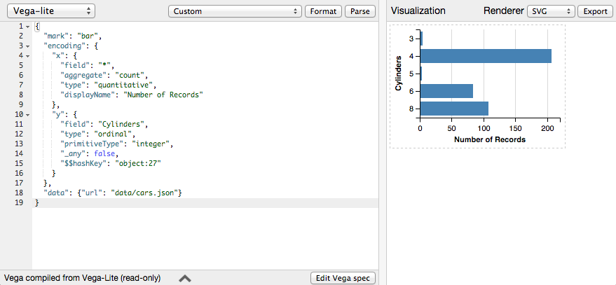

# Assignment 2: Visual Exploratory Data Analysis (EDA)


## Description: 
Use visualization to conduct exploratory data analysis on an existing dataset.

The goal of this assignment is to learn to use visualization as a tool to help you formulate and answer questions about data.  You will choose an existing dataset you are interested in, then use an off-the-shelf visualization tool to formulate and answer a series of questions, then produce a final visualization illustrating what you discovered.

You will keep a digital "process notebook" that documents all the questions you posed and steps you performed in order.

A variety of digital tools have been designed to help users visually explore data sets and confirm or disconfirm hypotheses about the data. 

## Data sets

You can use one of the built-in dataset in Voyager or any similar software.  

If you like movies, you could use this dataset pertaining to a large sample of movies. (The data includes the budgets, revenued and ratings from various sources.) Download: [movies.csv](https://datavis-sp16.github.io/datasets/movies.csv)

Here are some additional sources of interesting data:

<http://www.tableau.com/public/community/sample-data-sets>  
<http://vincentarelbundock.github.io/Rdatasets/datasets.html>  
<http://stats.stackexchange.com/questions/7/locating-freely-available-data-samples>  
<http://blog.visual.ly/data-sources/>  
<http://data.gov>  
<http://www.statistics.gov.uk/default.asp>  
<http://data.worldbank.org/data-catalog>  
<http://nwdata.org>  
<https://usa.ipums.org/usa/>  
<http://www.cdc.gov/nchs/data_access/data_tools.htm> 

\pagebreak

## Process

**Step 1 - Choose your data**  

A number of sample datasets are built-in to many visualization tools.  You are encouraged to use one of these, however, you may also chose any other dataset you find. You should choose a subject (and data) you are interested in.

**Step 2 - Pose an initial question you want to answer.**

Write your question down clearly.  Example questions: 

- Is there a relationship between movie budgets and reviews?  
- Is there a correlation between crime levels and night-time street illumination?  
- How does income vary with age in the US?

**Step 3 - Assess the fitness of your data for answering your question; wrangle if needed.**

Loos at the data, starting with the raw data. Does the data seem appropriate to the question? If not, do you need to find different data or a new question? Does the  data need to be cleaned or formated first? Perform any steps necessary to get the data into shape prior to visual analysis.  (You might do this in Excel, for example).

**Step 4 - Explore**

Build a visualization that answers your initial question. As you build the visualization, you may find your question changes. It may become more specific, may seem like a wrong question. The visualization may suugest new questions. Track the history of your questions and how you answered them. Fully designed visualizationa re not needed at this point. This is a notebook of your exploratory process.

**Step 5 - Final Visualization**

After answering all the questions you have to your satisfaction, think of a way to word the final or most important answer(s)—your findings. Design a way to present the data and your findings as clearly as possible. Use visualization software tools (and an illustration program if needed) to produce a final image.  Write a caption for the final graphic, as well as a paragraph describing the graphic and your findings.


## Deliverables

**PDF notebook**

Describe the dataset in a sentence or two, and indicate where you found it (a link, or a named built-in dataset.)

List the software tool(s) you used.

Write down the initial question clearly. 

Write down a record of what you did to construct a visualization to answer the question, what you found, and how the questions evolved. Was there a new question?  Did you alter the question? Repeat for each new question and visualization you develop. Include copies of any intermediate visualizations that helped you refine your questions. End with your final visualization, caption, and descriptive paragraph. Think of the final graphic, the caption and the paragraph as material for an article.

Be sure to also describe any transformations or rearrangements of the dataset that you needed to perform, inlcuding how you got the data into the format needed by the visualization system. 

Your final graphic will also be submitted as a separate JPG or PNG (in addition to being included in your PDF), and the caption and text will be included in a separate text file (see below), so that we can present them on screen.


### Tips for getting graphics into your notebook.

A few tools to get graphics into your notebook:

- Screen shot:  Use ```Shift+Command+4``` (Mac) to take a screenshot of a 
specific area of your screen (creates a PNG).  
- [SVG Crowbar](http://nytimes.github.io/svg-crowbar/) is a fantastic utility (from the NY times graphics department) that lets you download any SVG vector graphics from any webpage from your bookmarks bar. Only works in Chrome.  SVG can be opened in Illustrator (though some errors can occur).  
- If using [Voyager](http://vega.github.io/voyager/), you can export graphics like this:  Click  (be patient–it can be slow), then ```Vl Copy / Log``` to copy the "Vega-lite" code for the graphic to your clipboard.  Then, go to the [Vega Editor](http://vega.github.io/vega-editor/).  From the left most menu, select ```Vega-lite```, then paste the code in the left hand pane.  Press ```parse``` to draw the graphic.  On the right, set the renderer to ```SVG```, then press ```export```. An svg file will be downloaded that you can edit in Illustrator, or insert directly into a webpage.


\pagebreak 

## Submission and Critique

Due Thursday, 2/18 before class.  We will critique the submissions in class.  

To submit, log in to ELC, select Tools>Assignment Dropbox, then select “Assignment 2 DROPBOX.” If you do not yet have access to ELC, please email me ahead of time.

Upload:

- your PDF notebook, named "a2-lastname.pdf"  
- a single JPG (or PNG) image of your design, sized for on-screen viewing, named "a2-lastname.jpg" (or "a2-lastname.png")  
- a plain text file named "a2-lastname.md" (or a2-lastname.md) using this template (uses simple [markdown](https://help.github.com/articles/markdown-basics/) formatting):


```{md}

### Your Full Name

Assignment 2

Data: [here](http://link.to/dataset.csv)  
or name of built-in dataset

[Process Notebook](a2-lastname.pdf)


*Caption text to appear below the image.*

A paragraph describing the visualization. Think of this as text you might 
include in an article accompanying the graphic.  Use only simple markdown 
formatting if needed.
```


example:

```{md}
### Gary Jones

Assignment 2

Data: [here](http://databank.worldbank.org/data/download/Gender_Stats_csv.zip)  

[Process Notebook](a2-jones.pdf)


*Gender discrepencies across professions over time.*

Gender discrepencies are well known to exist... The figure shows how 
gender correlates with...  As the graph shows...  Lorem ipsum...
Pellentesque habitant morbi tristique senectus et netus et 
malesuada fames ac turpis egestas. Aliquam viverra purus lectus, a volutpat 
turpis malesuada sed. Suspendisse vulputate molestie enim, sed malesuada dui 
adipiscing ut. Aenean sagittis faucibus mi, quis hendrerit nisl bibendum sed.
```


