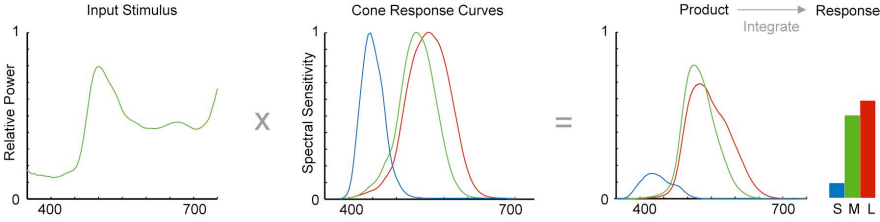
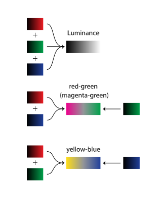
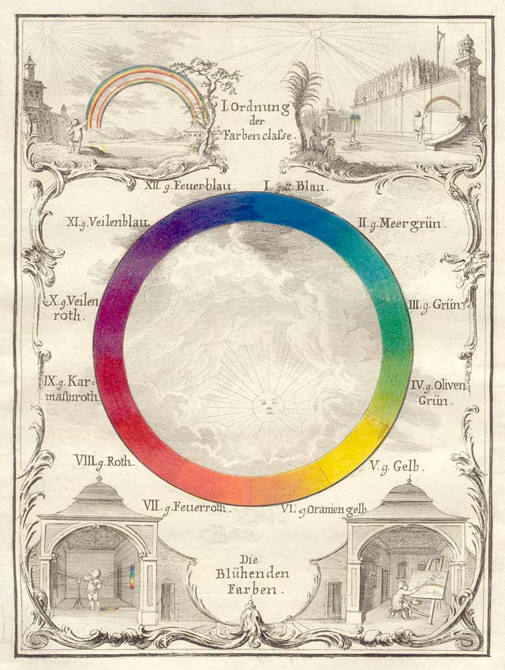
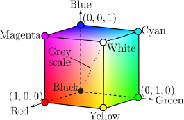
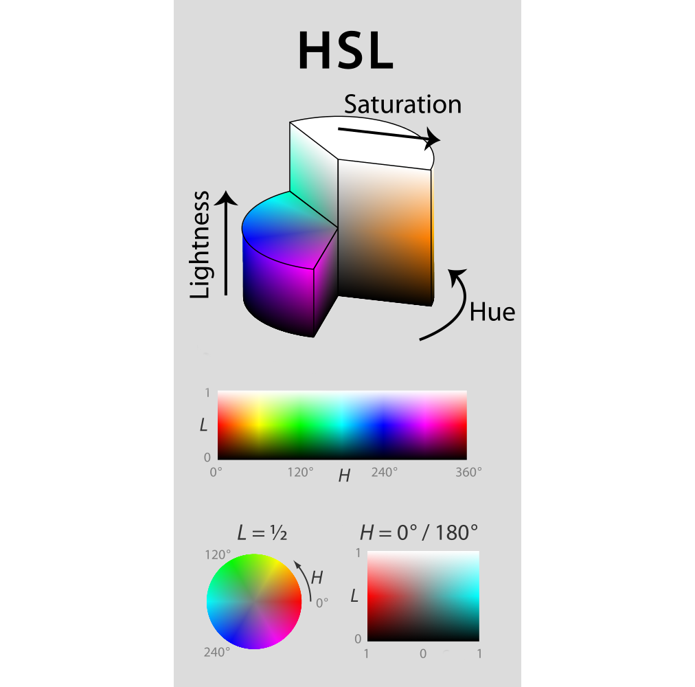

name: start
class: center, middle
background-size: contain  
background-image: url()

# Color

---
background-size: contain  
background-image: url(retina.jpg)

---

.width2[]

3 kinds of cone cells:  

"Red" = **Long** wavelengths  
most sensitive to yellow (565 nm), also sensitive to red and green

"Green" = **Mid** wavelengths  
most sensitive to green (540 nm), but lots of overlap with "red" cones. Less sensitive to yellow and red than "red" cones.  

"Blue" = **Short** wavelength  
most sensitive to blue (445 nm)

---

### Munsell Color System (HCV)

.width2[]
.width2[]

[https://en.wikipedia.org/wiki/Munsell_color_system](https://en.wikipedia.org/wiki/Munsell_color_system)

---

<mark>Light &rarr; Cone cell response</mark> &rarr; Opponent processing &rarr; Perception

  
.width1[]

[Maureen Stone. *A Field Huide to Digital Color.* Peters, 2003.](http://www.amazon.com/gp/product/1568811616/qid=1137018573/sr=2-1/ref=pd_bbs_b_2_1/102-3650979-5932915?s=books&v=glance&n=283155)

---

<mark>Light &rarr; Cone cell response</mark> &rarr; Opponent processing &rarr; Perception

.width2[]

Two different light spectra can produce the same cone response, and therefore produce the same perceived color.

---

Light &rarr; <mark>Cone cell response &rarr; Opponent processing</mark> &rarr; Perception

.width3[]

"Opponent Process Theory" describes how the ganglial cells process the signals from the cone cells.  Cone cell responses are combined by the ganglial cells to produce these three signals:  

- Lightness  
- "Red-Green" (magenta vs. green)  
- Yellow-Blue

The Ganglia send these three signals to the brain.

---
class: center, middle

# Color Spaces (Color Models)

## Historical Color Wheels

---

### Schiffermüller Color Wheel

.width2[]
.width2[]

---

background-size: contain  
background-image: url(harris.jpg)

### Harris Color Wheel

---

class: center, middle

# Color Spaces (Color Models)

## Physically based color models 

---

### RGB / CMYK

.width2[]

Red Green and Blue are the X Y and Z axes

CMY = complementary corners of the cube.

Points on the line from black to white have equal values of R, G and B. White is the maximum of all colors (R, G and B).

---

background-size: contain  
background-image: url(http://lh5.ggpht.com/wmfJZWmtuheZiTDrI3baoiki4j2KV5KBOU22MbXlVQrldceygV_Ipsmb0LkKZHXA8tTAX3p9zWkAcf1o8UQy7gW4nw=s650)

---

### HSL

.width2[]

.width2[]

