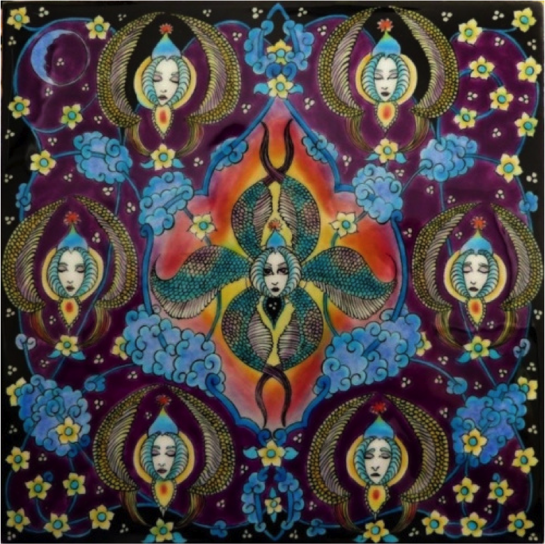
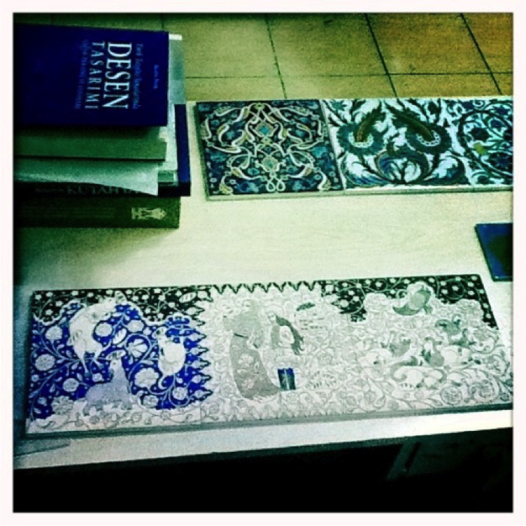

# Different Types of Artist Grants

- Fullbright Grants sponsored by US Government
- Individual artist grants that require nomination
	- MacArthur Grant, Joan Mitchell Grant
- Individual artist grants that artists can apply for directly
	- National Private Foundations, Regional and City-wide Private Foundations, 
State Arts Councils, Institutional Grants

---
# Fullbright Grants

- The U.S. Department of State's Bureau of Educational and Cultural Affairs sponsors the Fullbright Program.  Additional support comes from partner governments, foundations, corporations and host institutions

- Fulbright grantees' fields of study span the fine arts, humanities, social sciences, mathematics, natural and physical sciences, and professional and applied sciences.

- The Fulbright U.S. Student Program offers fellowships for U.S. graduating seniors, recent graduates, graduate students, young professionals and artists to research, study, or teach English abroad for one academic year.

---
# UGA Fullbright Assistance
Fulbright student grants are designed to give recent B.S./B.A. graduates, masters and doctoral candidates, and young professionals and artists opportunities for personal development and international experience. Grantees plan their own programs. Projects may include university coursework, independent library or field research, classes in a music conservatory or art school, special projects in the social or life sciences, or a combination of these areas. A limited number of travel grants are available to selected countries as well as grants for teaching English in secondary schools.

For an application or additional information, please contact:
**Maria A. De Rocher, derocher@uga.edu**

---
[http://us.fulbrightonline.org/about/fulbright-us-student-program](http://us.fulbrightonline.org/about/fulbright-us-student-program)

<iframe width="1000" height="600" frameborder="0" src="http://us.fulbrightonline.org/about/fulbright-us-student-program"><iframe>

---

Marie Porterfield, painted ceramic tile from Fullbright project in Turkey, 2011-2012

---

Marie Porterfield, Marie Porterfield, studio view, Kutahya, Turkey, 2011-2012

---
[https://honors.uga.edu/news/s_p/fulbright/porterfield.html](https://honors.uga.edu/news/s_p/fulbright/porterfield.html)

<iframe width="1000" height="600" frameborder="0" src="https://honors.uga.edu/news/s_p/fulbright/porterfield.html"><iframe>

---

<iframe width="1000" height="600" frameborder="0" src=""><iframe>

---
[https://kutahyailluminated.wordpress.com](https://kutahyailluminated.wordpress.com)
<iframe width="1000" height="600" frameborder="0" src="https://kutahyailluminated.wordpress.com"><iframe>

---
# Individual Artist Grants with direct application process:
## Grants from National Private Foundations:
- Creative Capital Foundation, $10,000 and up
- Pollack-Krasner Foundation, $10,000 and up

Pollack-Krasner application:

Artists can apply to The Pollock-Krasner Foundation by submitting an online application. Requirements for consideration are the application form, a cover letter, a current resume including an exhibition record, and ten digital images of current work with a corresponding identification list.  

---
[http://www.pkf.org/grant.html](http://www.pkf.org/grant.html)
<iframe width="1000" height="600" frameborder="0" src="http://www.pkf.org/grant.html"><iframe>

---
# Regional and City-wide Private Foundations:
- Pew Fellowships in the Arts for Pennsylvania artists - $60,000
- Kresge Artist Fellowships for Detroit artists- $25,000

# Georgia Private Foundations:

- Hudgens Prize for Georgia artists - $50,000
- Idea Capital for Atlanta artists - $500-2,000
- Flux Projects - $100-30,000

---
[http://thehudgens.org/the-hudgens-prize/hudgens-prize-finalists/](http://thehudgens.org/the-hudgens-prize/hudgens-prize-finalists/)
<iframe width="1000" height="600" frameborder="0" src="http://thehudgens.org/the-hudgens-prize/hudgens-prize-finalists/"><iframe>

---
[http://gyunhur.com/artwork/2258938_Spring_Hiatus.html](http://gyunhur.com/artwork/2258938_Spring_Hiatus.html)
<iframe width="1000" height="600" frameborder="0" src="http://gyunhur.com/artwork/2258938_Spring_Hiatus.html"><iframe>

---
# 32 States Give Grants to Individual Artists

- Alabama: $5000  
- Arizona,  Colorado: $2500  
- Connecticut, D.C., Delaware, Florida, Idaho, Indiana, Iowa, Kentucky, Louisiana, Maine, Maryland: $1,000 & $3,000 & $5,000,  
- Massachusetts: $5,000  
- Minnesota: $2,000 to $10,000
- Mississippi $2,000 to $10,000  
- Montana, Nebraska, Nevada: $5,000  
- New Jersey, New York: $7,000  
- North Dakota: $2,500  
- Ohio, Pennsylvania: $10,000  
- Rhode Island, South Carolina, South Dakota, Texas (Houston): $2,000 & $5000  
- Wyoming, Wisconsin: $8,000  
- West Virginia: $3,500  
- Virginia: $5,000

---
# Maryland Arts Council Application Form

- Web-based Application Form
- Hard copy of The Individual Artist Awards Application Form signed and mailed
- Images: 

**Visual Arts applicants must submit work samples as digital images.** Applicants must submit eight digital images depicting work completed after **July 27, 2012** (no works in progress). These **eight** images may include up to four detail shots. **No signatures or legible names may appear in the digital images or the application will be disqualified.** Images must be uploaded to the online application in the Work Sample Sheet tab within CueRate. The title, date of completion, dimensions, and materials of each work must be provided through the online CueRate Application. No composite images will be reviewed. A composite image is a single image file that is comprised of multiple images. A work sample with composite images will be disqualified. Images will be shown in the order they are uploaded, four at a time and will appear as you see them in image preview on the application.  

- Use the following specifications: Dimensions: 1240 pixels x 1240 pixels (maximum) File Size: 4.0 MB maximum for each image.  File Format: .jpg.  Resolution: 72dpi

---
# My Experience as a Panelist for the Mid-Atlantic Arts Foundation

- Four panelists from outside of Mid-Atlantic region
- No artist names or identifying information given
- Review is based on images of work and the quality of the photographic documentation 
- Review process occurred in several rounds
- In the first review, we simply scored the artists, and were given a short accompanying text if it was asked for by the panelists
- In the second review, we looked at the artists that received the highest scores, and had more discussion among the panelists
- Lots of disagreement – a different panel would result in different finalists

---
[http://kayhwang.com/sclp_1.html](http://kayhwang.com/sclp_1.html) 

<iframe width="1000" height="600" frameborder="0" src="http://kayhwang.com/sclp_1.html"><iframe>

---
# Institutional Grants and Awards:

## UGA Grants and Awards:  

- Mary Rosenblatt Award for graduates students & undergraduates,  $500 
- Willson Center Graduate Research Award, $1,250
- CURO Undergraduate Research Assistantships, $1,000

---
[http://curo.uga.edu/CURO_Research_Assistantship](http://curo.uga.edu/CURO_Research_Assistantship)
<iframe width="1000" height="600" frameborder="0" src="http://curo.uga.edu/CURO_Research_Assistantship"><iframe>
