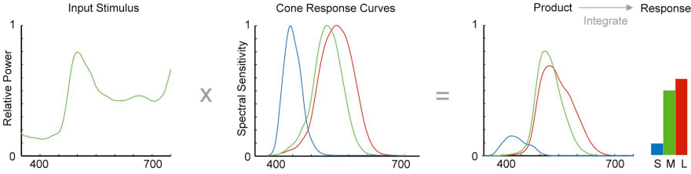
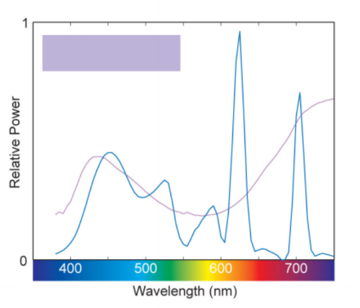
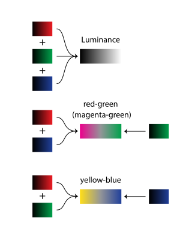
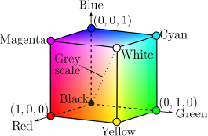

name: start
class: center, middle
background-image: url()

# Data Visualization
                
### ARGD 4080 / ARGD 4090 / ARST 7980

<https://datavis-sp16.github.io/>

---
class: center, middle

# Color Perception

---

### Light &rarr; Cone cell response &rarr; Opponent processing &rarr; Perception

---

background-image: url(retina.jpg)

---

<mark>Light &rarr; Cone cell response</mark> &rarr; Opponent processing &rarr; Perception

.width2[]

3 kinds of cone cells:  

"Red" = **Long** wavelengths  
most sensitive to yellow (565 nm), also sensitive to red and green

"Green" = **Mid** wavelengths  
most sensitive to green (540 nm), but lots of overlap with "red" cones. Less sensitive to yellow and red than "red" cones.  

"Blue" = **Short** wavelength  
most sensitive to blue (445 nm)

---

<mark>Light &rarr; Cone cell response</mark> &rarr; Opponent processing &rarr; Perception

  
.width1[]

[Maureen Stone. *A Field Huide to Digital Color.* Peters, 2003.](http://www.amazon.com/gp/product/1568811616/qid=1137018573/sr=2-1/ref=pd_bbs_b_2_1/102-3650979-5932915?s=books&v=glance&n=283155)

---

<mark>Light &rarr; Cone cell response</mark> &rarr; Opponent processing &rarr; Perception

.width2[]

Two different light spectra can produce the same cone response, and therefore produce the same perceived color.

---

Light &rarr; <mark>Cone cell response &rarr; Opponent processing</mark> &rarr; Perception

.width3[]

"Opponent Process Theory" describes how the ganglial cells process the signals from the cone cells.  Cone cell responses are combined by the ganglial cells to produce these three signals:  

- Lightness  
- "Red-Green" (magenta vs. green)  
- Yellow-Blue

The Ganglia send these three signals to the brain.

---
class: center, middle

# Color Spaces (Color Models)

## Historical Color Wheels

---

### Schiffermüller Color Wheel

.width2[]
.width2[]

---

background-image: url(harris.jpg)

### Harris Color Wheel

---

class: center, middle

# Color Spaces (Color Models)

## Physically based color models 

---

### RGB / CMYK

.width2[]

3 cartesian coodinates (R, G, B)

CMY = complementary corners of the cube.

Black = 0,0,0

Grey = equal values

White = all max values

---

background-image: url(http://lh5.ggpht.com/wmfJZWmtuheZiTDrI3baoiki4j2KV5KBOU22MbXlVQrldceygV_Ipsmb0LkKZHXA8tTAX3p9zWkAcf1o8UQy7gW4nw=s650)

---

### HSL / HSV

1 angle (hue) + 1 distance (saturation) + 1 cartesian coordinate (lightness or value)

.width2[]

.width2[]

---

class: center, middle

# Color Spaces (Color Models)

## Perceptually based color models 

---

### Munsell Color System (HCV)

.width2[]
.width2[]

[https://en.wikipedia.org/wiki/Munsell_color_system](https://en.wikipedia.org/wiki/Munsell_color_system)

---

### LAB (L\*a\*b)

3 cartesian coordinates (Lightness, A, B); Very similar hue wheel and space to Munsell System.  Based on Opponent Processing.

.width3[]

.width3[]

---

### HCL

Hue, Chroma, Lightness: same color space as LAB, with angle and distance replacing cartesian coordinates a & b.

.width2[]

---

# Reading: Color in datavis

Gregor Aisch: [https://vis4.net/blog/posts/avoid-equidistant-hsv-colors/](https://vis4.net/blog/posts/avoid-equidistant-hsv-colors/)

[https://vis4.net/blog/posts/mastering-multi-hued-color-scales/](https://vis4.net/blog/posts/mastering-multi-hued-color-scales/)

Peter Kovesi: [http://peterkovesi.com/projects/colourmaps/ColourmapTheory/index.html](http://peterkovesi.com/projects/colourmaps/ColourmapTheory/index.html)

Drew Skau: [“Dear NASA: No More Rainbow Color Scales, Please.”](http://blog.visual.ly/rainbow-color-scales/) blog post, Visually. 

[http://blog.ericmarty.com/5/global-ocean-surface-waves-visualized](http://blog.ericmarty.com/5/global-ocean-surface-waves-visualized)

---

# Color Blindness

trichromacy = normal vision 

deuteranopia = red-green defficient (affects ~15% of men)

Other forms of colorblindness are possible

[https://www.youtube.com/watch?v=6RuOt28orRI](https://www.youtube.com/watch?v=6RuOt28orRI)

Photoshop Filters: http://www.adobe.com/accessibility/products/photoshop.html

ColorBrewer and other tools listed in later slides can generate color-blind safe pallettes.

tetrachromacy = extra cone type, larger color space than normal

S. Deleniv: [http://theneurosphere.com/2015/12/17/the-mystery-of-tetrachromacy-if-12-of-women-have-four-cone-types-in-their-eyes-why-do-so-few-of-them-actually-see-more-colours/](http://theneurosphere.com/2015/12/17/the-mystery-of-tetrachromacy-if-12-of-women-have-four-cone-types-in-their-eyes-why-do-so-few-of-them-actually-see-more-colours/)

---

class: center, middle

# Color Tools

---
HCL: Chroma.js Pallettes [http://gka.github.io/palettes/](http://gka.github.io/palettes/)

<iframe width="1000" height="600" frameborder="0" src="http://gka.github.io/palettes/#colors=black,white|steps=7|bez=1|coL=1"><iframe>

---
HCL Color Picker:  [https://bl.ocks.org/mbostock/3e115519a1b495e0bd95](https://bl.ocks.org/mbostock/3e115519a1b495e0bd95)

<iframe width="1000" height="600" frameborder="0" src="https://bl.ocks.org/mbostock/3e115519a1b495e0bd95"><iframe>

---
HCL Color Picker:  [https://bl.ocks.org/mbostock/3e115519a1b495e0bd95](https://bl.ocks.org/mbostock/3e115519a1b495e0bd95)

<iframe width="1000" height="600" frameborder="0" src="https://bl.ocks.org/mbostock/3e115519a1b495e0bd95"><iframe>

---

### More HCL Tools

[http://tristen.ca/hcl-picker/](http://tristen.ca/hcl-picker/)

[http://tools.medialab.sciences-po.fr/iwanthue/](http://tools.medialab.sciences-po.fr/iwanthue/)

[http://hclwizard.org/creator/](http://hclwizard.org/creator/)

[http://hclarke.ca/colour-picker.html](http://hclarke.ca/colour-picker.html)

---

