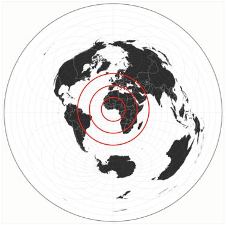
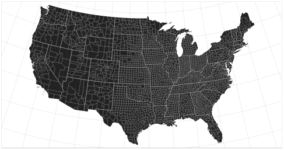
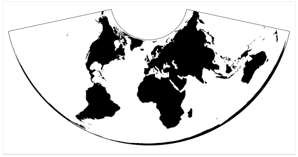
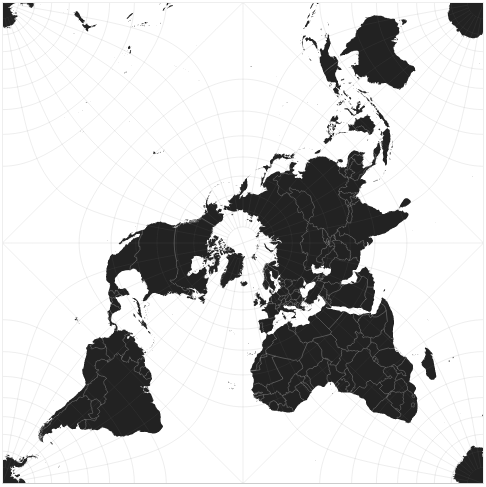
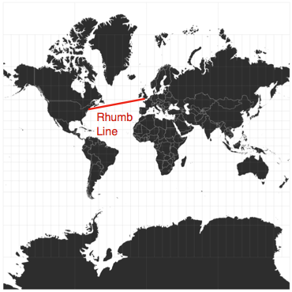
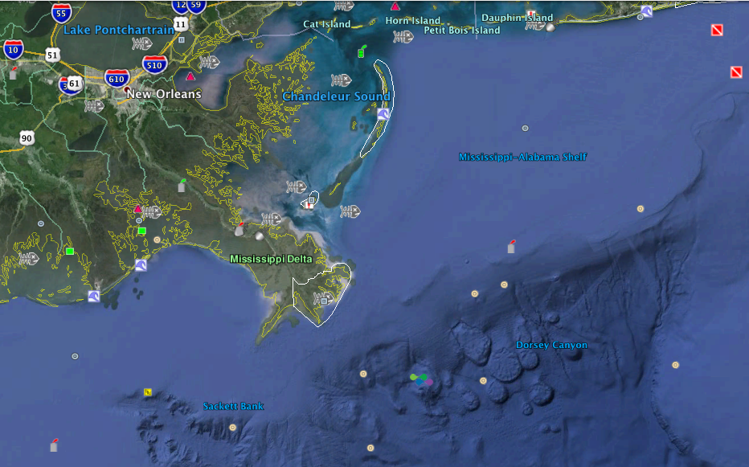

name: start
class: center, middle
background-image: url()

# Data Visualization
                
### ARGD 4080 / ARGD 4090 / ARST 7980

<https://datavis-sp16.github.io/>

---
class: center, middle

# GIS & Cartography

*Much of this content derived from slides by Jeff Heer and Michal Migurski*

---
class: center, bottom  
background-image: url(http://i.dailymail.co.uk/i/pix/2010/05/05/article-1272921-093BA55C000005DC-175_634x426.jpg)

Henricus Martelus, WORLD MAP, c1490 

---
class: center, bottom  
background-image: url(http://i.dailymail.co.uk/i/pix/2010/05/08/article-1272921-0925FB6A000005DC-478_634x522.jpg)

Charles Booth, DESCRIPTIVE MAP OF LONDON POVERTY, 1889

---
class: center, bottom  
background-image: url(http://i.dailymail.co.uk/i/pix/2010/05/05/article-1272921-09363F4F000005DC-499_634x428.jpg)

Harry Beck, LONDON TUBE MAP, 1933

---
class: center, middle

### [earth.nullschool.net](earth.nullschool.net)

---
class: left, top
                
.left-column[
### Projections
### Scale
### Mapping Data
]	
.right-column-fat[
]

---
class: left, top
                
.left-column[
### <mark>Projections</mark>
### Scale
### Mapping Data
]	
.right-column-fat[
.width1[
  
]
]

---
class: left, top
                
.left-column[
### <mark>Projections</mark>
### Scale
### Mapping Data
]	
.right-column-fat[
A **Projection** is a systematic (mathematical) "stretching" of the surface of the sphere onto a flat plane.  Every projection preserves some aspects of the geometry and distorts other aspects.  

Therefore, there is no truthful map of the earth.

**3 categories of Map Projections:**

* Azimuthal
	* Preserves direction and distance
* Equal Area
	* Preserves area
* Conformal
	* Preserves local angles (straight lines on the sphere look straight on the plane.)

[Wikipedia: Map Projections](https://en.wikipedia.org/wiki/Map_projection)

]

---
class: left, top
                
.left-column[
### <mark>Projections</mark>
### Scale
### Mapping Data
]	
.right-column-fat[

* Azimuthal (Preserves direction and distance)
	* [example: "Azimuthal Equidistant"](http://en.wikipedia.org/wiki/Azimuthal_equidistant_projection)
	
.width2[
  
[http://bl.ocks.org/mbostock/3757110](http://bl.ocks.org/mbostock/3757110)
]	
]

---
class: left, top
                
.left-column[
### <mark>Projections</mark>
### Scale
### Mapping Data
]	
.right-column-fat[

* Equal Area (Preserves area)
	* [example: "Albers Equal Area Conic"](http://en.wikipedia.org/wiki/Albers_projection)
	
.width1[  
[http://bl.ocks.org/mbostock/3734308](http://bl.ocks.org/mbostock/3734308)]
]

---
class: left, top
                
.left-column[
### <mark>Projections</mark>
### Scale
### Mapping Data
]	
.right-column-fat[

* Equal Area (Preserves area)
	* [example: "Albers Equal Area Conic"](http://en.wikipedia.org/wiki/Albers_projection)
	
.width2[  
[http://bl.ocks.org/mbostock/3788999](http://bl.ocks.org/mbostock/3788999)]	
]

---
class: left, top
                
.left-column[
### <mark>Projections</mark>
### Scale
### Mapping Data
]	
.right-column-fat[

* Conformal (Preserves local angles)
	* [example: "Peirce Quincuncial"](http://en.wikipedia.org/wiki/Peirce_quincuncial_projection)
	
.width2[  
[http://bl.ocks.org/mbostock/4310087](http://bl.ocks.org/mbostock/4310087)]
]

---
class: left, top
                
.left-column[
### <mark>Projections</mark>
### Scale
### Mapping Data
]	
.right-column-fat[

* Conformal (Preserves local angles)
	* [example: "Mercator"](http://en.wikipedia.org/wiki/Mercator_projection)
	
.width2[  
[http://bl.ocks.org/mbostock/3757132](http://bl.ocks.org/mbostock/3757132)]
]

---
class: left, top
                
.left-column[
### <mark>Projections</mark>
### Scale
### Mapping Data
]	
.right-column-fat[

[Tissot's Indicatrix](https://en.wikipedia.org/wiki/Tissot%27s_indicatrix) (Orthographic, Azimuthal Equidistant, Mercator, Peirce Quincuncial)  
.width1[]
.width2[]
.width2[]
.width2[]
]

---
class: left, top
                
.left-column[
### <mark>Projections</mark>
### Scale
### Mapping Data
]	
.right-column-fat[

[Tissot's Indicatrix](https://en.wikipedia.org/wiki/Tissot%27s_indicatrix) (Albers)  
.width1[]
]

---
class: left, top
                
.left-column[
### <mark>Projections</mark>
### Scale
### Mapping Data
]	
.right-column-fat[

### See Also:

[http://demonstrations.wolfram.com/DistortionsInMapProjections/](http://demonstrations.wolfram.com/DistortionsInMapProjections/)

[Wikipedia: Dymaxion Map](https://en.wikipedia.org/wiki/Dymaxion_map)  
[Interactive Dymaxion Map](http://teczno.com/faumaxion-II/)

.width2[
  
[Geoff Manaugh: *Cracking the Planet*](http://www.bldgblog.com/2009/12/cracking-the-planet/)
]
]

---
class: left, top
                
.left-column[
### <mark>Projections</mark>
### Scale
### Mapping Data
]	
.right-column-fat[

### See Also:

.width3[]  

[http://xkcd.com/977/](http://xkcd.com/977/)
]

---
class: left, top
                
.left-column[
### Projections
### <mark>Scale</mark>
### Mapping Data
]	
.right-column-fat[

**For a small area, earth's curvature can be ignored, and a map can use a single scale.**

**For a large area, map projections cause any scale to be variable**

]

---
class: left, top
                
.left-column[
### Projections
### <mark>Scale</mark>
### Mapping Data
]	
.right-column-fat[

**Scale is often expressed as a ratio without units**

1:250,000

This concept is borrowed from print, where the dimensions of a printed map are constant.  For screen, since the physical dimensions of the image can vary with the screen, ratio scales are less useful.  Therefore, online, we tend to use graphic scale bars.

]

---
class: left, top
                
.left-column[
### Projections
### <mark>Scale</mark>
### Mapping Data
]	
.right-column-fat[

**Content should be appropriate to the scale.**

Modern mapping tools can dynamically control what content is visiable at each scale level, automatically.

]

---
class: left, top
                
.left-column[
### Projections
### Scale
### <mark>Mapping Data</mark>

* <mark>Symbol Maps</mark>
	* Dot Map
* Continuous Data
	* Chorodots
	* Heatmaps
	* Choropleth
* Cartograms
* Flow Maps

]	
.right-column-fat[

.width1[

]
]

---
class: left, top
                
.left-column[
### Projections
### Scale
### <mark>Mapping Data</mark>

* Symbol Maps
	* <mark>Dot Map</mark>
* Continuous Data
	* Chorodots
	* Heatmaps
	* Choropleth
* Cartograms
* Flow Maps

]	
.right-column-fat[

Dot maps are an extension of scatterplots and bubble charts to maps.

.width2[]
.width2[]
.width2[]
.width2[]

]

---
class: left, top
                
.left-column[
### Projections
### Scale
### <mark>Mapping Data</mark>

* Symbol Maps
	* Dot Map
* <mark>Continuous Data</mark>
	* Heatmaps
	* Choropleth
* Cartograms
* Flow Maps

]	
.right-column-fat[

]

	http://earth.nullschool.net/
	http://blog.ericmarty.com/5/global-ocean-surface-waves-visualized

]
