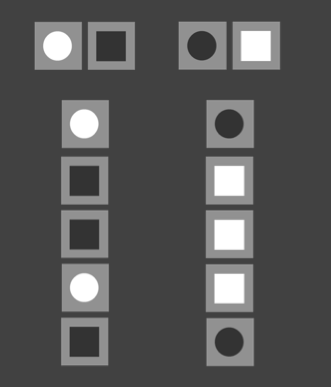

name: start
class: center, middle
background-image: url()

# Data Visualization
                
### ARGD 4080 / ARGD 4090 / ARST 7980

<https://datavis-sp16.github.io/>

---
class: center, middle

# Graphic Perception

### (continued)

---
.left-column[
### Graphical Perception

Signal Detection  
Magnitude Estimation  
<mark>Pre-Attentive Processing</mark>  
Multiple Visual Encodings  
Gestalt  
Change Blindness  
]

.right-column-fat[
**Pre-attentive processing** = unconscious imformation processing

- The brain first pre-processes all the information in a scene unconsciously. 
- The most salient information is passed on for conscious (attentive) processing.

**Salient Information** is information that:

- stands out the most ("pops"), or 
- is relevant to what a person is thinking about

[https://en.wikipedia.org/wiki/Pre-attentive_processing](https://en.wikipedia.org/wiki/Pre-attentive_processing)

[https://en.wikipedia.org/wiki/Feature\_integration\_theory](https://en.wikipedia.org/wiki/Feature_integration_theory)

]

---
.left-column[
### Graphical Perception

Signal Detection  
Magnitude Estimation  
<mark>Pre-Attentive Processing</mark>  
Multiple Visual Encodings  
Gestalt  
Change Blindness  
]

.right-column-fat[

.width1[

]

<small>image credit: Anne Stevens. [http://stevensanne.com/data-viz-in-6-weeks-wk-3-perception-cognition/](http://stevensanne.com/data-viz-in-6-weeks-wk-3-perception-cognition/)</small>
]

---
.left-column[
### Graphical Perception

Signal Detection  
Magnitude Estimation  
<mark>Pre-Attentive Processing</mark>  
Multiple Visual Encodings  
Gestalt  
Change Blindness  
]

.right-column-fat[

**Unique single features** are detected preattentively more easily than combinations of features.

]

---
.left-column[
### Graphical Perception

Signal Detection  
Magnitude Estimation  
<mark>Pre-Attentive Processing</mark>  
Multiple Visual Encodings  
Gestalt  
Change Blindness  
]

.right-column-fat[

**Unique single features** are detected preattentively more easily than combinations of features.

]

---
.left-column[
### Graphical Perception

Signal Detection  
Magnitude Estimation  
Pre-Attentive Processing  
<mark>Multiple Visual Encodings</mark>  
Gestalt  
Change Blindness  
]

.right-column-fat[

**Single dimension encodings**

  
<small>based on slide by Jeff Heer</small>
]

---
.left-column[
### Graphical Perception

Signal Detection  
Magnitude Estimation  
Pre-Attentive Processing  
<mark>Multiple Visual Encodings</mark>  
Gestalt  
Change Blindness  
]

.right-column-fat[

**Redundant encodings** can help pre-attentive processing.

  
<small>based on slide by Jeff Heer</small>
]

---
.left-column[
### Graphical Perception

Signal Detection  
Magnitude Estimation  
Pre-Attentive Processing  
<mark>Multiple Visual Encodings</mark>  
Gestalt  
Change Blindness  
]

.right-column-fat[

**"Orthagonal" encodings** can interfere with pre-attentive processing.

  
<small>based on slide by Jeff Heer</small>
]

---
.left-column[
### Graphical Perception

Signal Detection  
Magnitude Estimation  
Pre-Attentive Processing  
Multiple Visual Encodings  
<mark>Gestalt</mark>  
Change Blindness  
]

.right-column-fat[

**Gestalt:** "shape or form" (German)

**Gestalt Theory** tries to explain how our brain generates mental perceptions of whole forms out of incomplete or chaotic stimulus.

.width2[

]  

[https://en.wikipedia.org/wiki/Gestalt_psychology](https://en.wikipedia.org/wiki/Gestalt_psychology)
]

---
.left-column[
### Graphical Perception

Signal Detection  
Magnitude Estimation  
Pre-Attentive Processing  
Multiple Visual Encodings  
Gestalt  
<mark>Change Blindness</mark>  
]

.right-column-fat[

## INSTRUCTIONS:

### In the following video, <mark>count how many passes</mark> the players in <mark>white</mark> make.

]

---

<iframe width="560" height="315" src="https://www.youtube.com/embed/UfA3ivLK_tE" frameborder="0" allowfullscreen></iframe>

---
More: [http://www.psych.ubc.ca/~rensink/flicker/download/](http://www.psych.ubc.ca/~rensink/flicker/download/)

