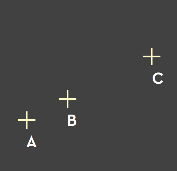
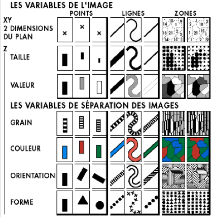
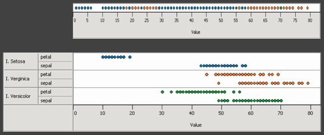
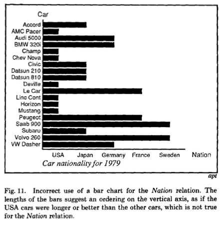

name: start
class: center, middle
background-image: url()

# Data Visualization
                
### ARGD 4080 / ARGD 4090 / ARST 7980

<https://datavis-sp16.github.io/>

---
class: center, middle

# Image Model

---
class: left, top

### Image = Visual Language (system of signs) 

- Images are perceived as a set of signs  
- Sender encodes information in signs 
- Receiver decodes information from signs

---
class: left, top

### Semiology (or semiotics) = the study of signs 

- sign = signifier+signified
- signifier = the *form* a sign takes
- signified = the *concept* the sign represents

**example: STOP**  

signifier = the word "stop" (the letterforms, all caps)  
signified = the concept of a requirement to stop

---
class: left, top

### Bertin's Semiology of Graphics 

Jaques Bertin, *Sémiologie Graphique,* 1967

<quote>*"Resemblance, order and proportion are the three signfields in graphics."*</quote> -Bertin

Nominal Data &rarr; Resemblance  
Ordinal Data &rarr; Order  
Quantitative &rarr; Proportion  

---
class: left, top

.left-column-50[.width1[]]

.right-column-50[

1. A, B, C are distinguishable;  
2. B is between A and C;  
3. BC is twice as long as AB;  

Therefore, the graphic can encode quantitative variables.
]

---
class: left, top

.left-column-50[.width1[]]

.right-column-50[
### Bertin's visual encoding variables

Position (x 2)  
Size  
Value   
Texture  
Color  
Orientation  
Shape

]

---
class: left, top

### Expanded list of visual encoding variables

Position  

Length  
Area  
Volume  

Value  
Hue  
Texture

Orientation  
Shape  

Transparency, Blur, Focus...

What else?

---
class: left, top

### Bertin's Mappings (expanded)

Position &larr; **NOQ**  

Length &larr; **NOQ**  
Area &larr; **NOQ**  
Volume &larr; **NOQ**  

Value &larr; **NO (Q)**  
Hue &larr; **N (OQ)**  
Texture &larr; **N (O)**

Orientation &larr; **N (O? Q?)**  
Shape &larr; **N (O?)**  

Transparency, Blur, Focus... &larr; **N (O?)**

---
class: left, top

Nominal and Ordinal Color pallettes:

[colorbrewer](http://colorbrewer2.org/) 

Ordinal Color Scales:

[chroma.js](http://gka.github.io/palettes/#colors=#061951,#96FFBD|steps=7|bez=1|coL=1) 

---
background-image: url(playfair.png)

---
class: left, top

### Encodings

X-axis &larr; year (Q)  
Y-axis &larr; currency (Q)  
Color &larr; imports/exports (N, O)  

---
background-image: url(https://upload.wikimedia.org/wikipedia/commons/5/5f/Minard%27s_Map_%28vectorized%29.svg)

---
class: left, top

### Encodings

Composite graphic (2 linked panels)

**Top Panel**

XY Position &larr; Army Position (QxQ)
- X-axis &larr; Longitude (Q)  
- Y-axis &larr; Lattitude (Q)  
Width &larr; Army Size (Q)  
Y-axis &larr; Time (O)  
Color &larr; Time (N, O)  

**Bottom Panel**

X-axis &larr; Longitude (Q); Time (O)  
Y-axis &larr; Temperature (Q)  

---
class: left, top

# Design Criteria

### Consistency (-Heer)    

The **properties of the image** (visual variables) should match the **properties of the data**.

TRANSLATION: Don't lie (even by ommission).
### Ordering (-Heer)  

Encode the **most important information** in the **most effective way**.

---
class: left, top

### Effectiveness (-Mackinlay)  
An *effective* visualization conveys information in readily **perceivable** way. Use encodings that can be decoded the fastest and most accurately.

### Expressiveness (-Mackinlay)
Data is *expressible* in a visual language if the signs express **all the facts and only the facts** in the data.
.left-column-50[
.width1[]  
Visual language cannot express all the facts in the data.
]
.right-column-50[
.width2[]  
Visual language expresses facts not in the data.
]

