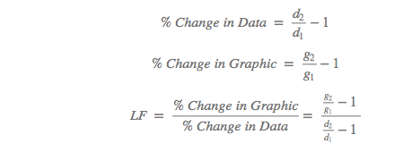
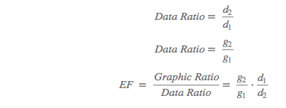

name: start
class: center, middle
background-image: url()

# Data Visualization
                
### ARGD 4080 / ARGD 4090 / ARST 7980

<https://datavis-sp16.github.io/>

---
class: center, middle

# Excellence and Integrity in Data Graphics

---
class: left, top

# Tufte: "Graphical Excellence"

### History:  

- Maps  
- Time Series  
- Relational Graphics  

---
class: left, top

### Principles of Excellence

1. Well-designed presentation of interesting data
	- Substance
	- Statistics
	- Design
2. Complex ideas communicated with 
	- Clarity
	- Precision
	- Efficiency
3. Greatest number of ideas in shortest time with the least ink in the smallest space
4. Nearly always multivariate
5. Tells the truth about the data

---
class: left, top

# Tufte: Graphical Integrity

<quote>There are three kinds of lies: lies, damned lies, and statistics. </quote>
.right[
<small>- Mark Twain, attributing British Prime Minister Benjamin Disraeli</small>
]

---
background-image: url(p54top.png)

---
background-image: url(p54bottom.png)

---
background-image: url(http://static.politifact.com.s3.amazonaws.com/politifact%2Fphotos%2Fmega-center-release-graphic.jpg)

---
background-image: url(http://www.autostraddle.com/wp-content/uploads/2015/09/PPgraph-640x561.jpeg)

---
background-image: url(http://cloudfront.mediamatters.org/static/uploader/image/2015/09/30/kevin_drum_ppfa.jpg)

---
background-image: url(http://cloudfront.mediamatters.org/static/uploader/image/2015/09/30/kevin_drum_ppfa_all_services.jpg)

---
### Principles of Integrity

1. Graphic marks should be directly proportional to the numerical quantities.
2. Use clear, detailed and thorough labeling to defeat graphical distortion and ambiguity.
	- write explanations on the graphic itself
	- label important events
3. Show data variation, not design variation.  
4. Use standardized units that compensate for inflation, etc. (Compare apples to apples)
5. Number of dimensions depicted should not exceed the number of dimensions in the data.
6. Graphics must not quote data out of context.

---
### Sources of accidental or intentional “Distortion” (i.e. Lies)

- Proportion (Graphics not proportionals to data)
	- solution: make’em proportional
		ex: p. 55(top) - graphics not directly proportional to data 
- Perception (Visual perception not taken into account)
	- solution: adjust proportions to match perceptual scales, when appropriate
		ex: 
	- solution: label graphics
		ex: 
- Design inconsistency 
	- solution: keep design constant (scales, “marks”)  
		ex: pp. 60, 61

---

### Some additional principals: 
- decorate outside the graphic, not inside.
- perspective drawing makes it difficult to judge proportions objectively

---
### Measuring Graphical Integrity

**Tufte's "Lie Factor" (LF)**

--

LF = 1 = Truth (no lie)

---
### Measuring Graphical Integrity

**Improved "Exaggeration Factor" (EF)**  
*(I am officially coining this term here. You heard it first.)*

--

EF = 1 = Truth (no lie)  
--

Lies of equal magnitude produce equal EF

---
background-image: url(perspective_distortion.png)

---
background-image: url(LieDetector.png)