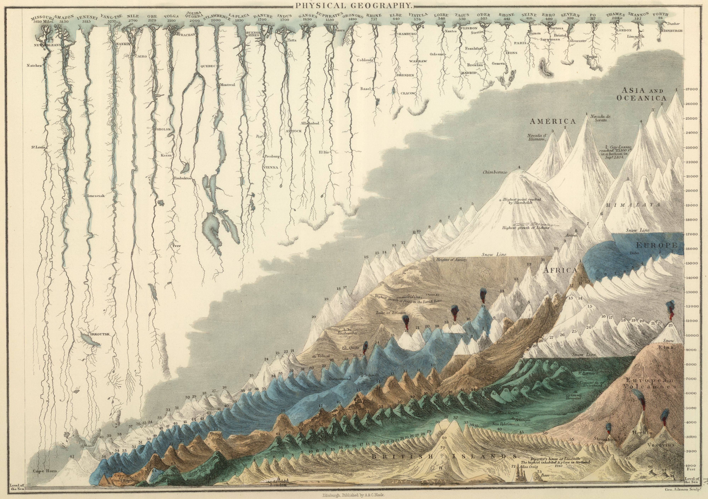

name: start
class: center, middle
background-image: url()

# Data Visualization
                
### ARGD 4080 / ARGD 4090 / ARST 7980
        
---
name: purpose
class: left, top
        
### Purpose of Data Visualization  
        
.left-column-50[
1. **Recording of Data**  
	Collection of data in visual form  
	(photographs, seismographs, etc.)
	
2. **Analysis of Data**  
 	Pattern discovery  
	Error identification    
 	Memory expansion  
	Contextualization 
]
.right-column-50[
3.	**Reasoning**  
	Development and assessment of hypotheses  
	Decision making  

4. **Communication**  
	Communicattion of findings  
	(to the public or other researchers)  
	Argument  
	Storytelling  
	Inspiration / Motivation  
	Propaganda / Misinformation
]

---
name: record
class: left, top
                
.left-column[
### Purpose

1. **Recording of Data**  
	Collection of data in visual form  
	(photographs, seismographs, etc.)
]	
.right-column-fat[
.width2[
  
<small>Photograph of particle tracks in a bubble chamber, with explanitory diagram. [info](https://goo.gl/vmfUCf)</small>
]
]

---
background-image: url(https://upload.wikimedia.org/wikipedia/commons/1/14/HD.6D.635_%2812000265314%29.jpg)

---
background-image: url(https://upload.wikimedia.org/wikipedia/commons/0/0f/Kinemetrics_seismograph.jpg)

---
background-image: url( http://payload168.cargocollective.com/1/12/386676/5678497/DarknessMapSF_900.jpg)

---
name: analysis
class: left, top
                
.left-column[
### Purpose

2. **Analysis of Data**  
 	<mark>Pattern discovery</mark>  
	Error identification    
 	Memory expansion  
	Contextualization 
]	
.right-column-fat[
.width1[
  
<small>Photograph of particle tracks in a bubble chamber, with explanitory diagram. [NASA](http://www.giss.nasa.gov/research/news/20140121/)</small>
]
]

---
class: left, top
                
.left-column[
### Purpose

2. **Analysis of Data**  
 	<mark>Pattern discovery</mark>  
	Error identification    
 	Memory expansion  
	Contextualization 
]	

.right-column-fat[
.width1[
  
<small>Carl Sagan (*Dragons of Eden*)</small>
]
]

---
class: left, top
                
.left-column[
### Purpose

2. **Analysis of Data**  
 	Pattern discovery  
	<mark>Error identification</mark>    
 	Memory expansion  
	Contextualization 
]	

.right-column-fat[
.width1[

]
]

---
class: left, top
                
.left-column[
### Purpose

2. **Analysis of Data**  
 	Pattern discovery  
	Error identification    
 	<mark>Memory expansion</mark>  
	Contextualization 
]	

.right-column-fat[
- maps  
- What else?
]

---
class: left, top
                
.left-column[
### Purpose

2. **Analysis of Data**  
 	Pattern discovery  
	Error identification    
 	Memory expansion  
	<mark>Contextualization</mark> 
	
	  
	<small>John Snow: Mapped positions of deaths from cholera in London. The map revealed a cluster of cases around a water pump, with density of cases decreasing with distance from the pump. 1854.  [from Tufte 83]</small>
	
]	
.right-column-fat[
.width1[

]
]

---
name: fields

.left-column[
### Related Fields

Data Visualization  
Data Journalism  
Data Science  
Exploratory Data Analysis  
Infographics\*  
Information Design\*  
Information Visualization  
Scientific Illustration  
Scientific Visualization\*  
Statistical Graphics\*  
Technical Illustration  
Visual Analytics
]

---
name: datavis

.left-column[
### Related Fields

<mark>Data Visualization</mark>  
Data Journalism  
Data Science  
Exploratory Data Analysis  
Infographics  
Information Design  
Information Visualization  
Scientific Illustration  
Scientific Visualization  
Statistical Graphics  
Technical Illustration  
Visual Analytics
]

.right-column-fat[

The *accurate* visual representation of data.  The field of data visualization has a well established theory and shared terminology.  

.width4[

]
.width4[

]
.width4[

]
.width4[

]
.width4[

]
.width4[

]
.width4[

]
.width4[

]
]

---
name: data_journalism

.left-column[
### Related Fields

Data Visualization  
<mark>Data Journalism </mark>  
Data Science  
Exploratory Data Analysis  
Infographics  
Information Design  
Information Visualization  
Scientific Illustration  
Scientific Visualization  
Statistical Graphics  
Visual Analytics
]

.right-column-fat[

Journalism making heavy use of design, computer science and statistics, particularly data visualization, to tell a story.

http://www.nytimes.com/upshot

http://www.theguardian.com/data
]

---
.left-column[
### Related Fields

Data Visualization  
Data Journalism  
<mark>Data Science</mark>  
Exploratory Data Analysis  
Infographics  
Information Design  
Information Visualization  
Scientific Illustration  
Scientific Visualization  
Statistical Graphics  
Visual Analytics
]

.right-column-fat[

An interdisciplinary field concerned with systems for extracting knowledge or insights from data.  Data visualization is an important tool of data science.

  
<small>\- posted in [Data Science LA](http://data-science-la.tumblr.com/post/82349580838/data-science-toolbox-survey)</small>
]

---
.left-column[
### Related Fields

Data Visualization  
Data Journalism  
Data Science  
<mark>Exploratory Data Analysis</mark>  
Infographics  
Information Design  
Information Visualization  
Scientific Illustration  
Scientific Visualization  
Statistical Graphics  
Visual Analytics
]

.right-column-fat[

An approach to analyzing data sets in order to summarize their main characteristics, using data visualization and statistical techniques. An early step in any process involving data visualization. 

See:  
Tukey, John W. (1977). *Exploratory Data Analysis*. Pearson. ISBN 978-0201076165.
]

---
.left-column[
### Related Fields

Data Visualization  
Data Journalism  
Data Science  
Exploratory Data Analysis  
<mark>Infographics</mark>  
Information Design  
Information Visualization  
Scientific Illustration  
Scientific Visualization  
Statistical Graphics  
Visual Analytics
]

.right-column-fat[

The use of graphic visual representations of information, data or knowledge intended to present information quickly and clearly.  Data visualization is one tool of infographics, however infographics do not require data accurate representations *per se*, as they are primarily intended to inform and not to suport rigorous analysis.

.width2[

]
.width2[

]
]

---
.left-column[
### Related Fields

Data Visualization  
Data Journalism  
Data Science  
Exploratory Data Analysis  
Infographics  
<mark>Information Design</mark>  
Information Visualization  
Scientific Illustration  
Scientific Visualization  
Statistical Graphics  
Visual Analytics
]

.right-column-fat[

In Graphic Design, the practice of designing effective display of information (see infographic).  While it may incorporate data visualization, information design is concerned with the effective communication of any specific information, not just tabular data.

.width2[
   
]
.width2[
  
]
<small>LEFT: Florence Nightingale's diagram of the causes of mortality in the military.  The diagram led directly to the understanding of sanitation in public health, and to drastically decreased mortality among soldiers. RIGHT: Otto Neurath's *International picture language*, 1936</small>
]

---
.left-column[
### Related Fields

Data Visualization  
Data Journalism  
Data Science  
Exploratory Data Analysis  
Infographics  
Information Design  
<mark>Information Visualization</mark>  
Scientific Illustration  
Scientific Visualization  
Statistical Graphics  
Visual Analytics
]

.right-column-fat[

More or less synonymous with "data visualization."

See https://flowingdata.com/2011/09/29/the-many-words-for-visualization/ for Nathan Yau's no B.S. interpretation of the various terms...

]

---
class: center, middle

<iframe width="1024" height="500" src="http://bl.ocks.org/aaizemberg/raw/95c140c8695ec339d0b7/5569283ea7b17fcc839cb1d2f55d62e590fd7bdb/" frameborder="0"></iframe>

Use of the term "Information Visualization" seems to be confined mostly to the US (and South Korea).  Everywhere, "Data Visualization" is the more common term.  View the [full report](http://www.google.com/trends/explore?hl=en-US#q=data+visualization,+information+visualization&cmpt=q&tz&tz) on Google Trends to explore regional useage of the terms.

---
.left-column[
### Related Fields

Data Visualization  
Data Journalism  
Data Science  
Exploratory Data Analysis  
Infographics  
Information Design  
Information Visualization  
<mark>Scientific Illustration</mark>  
Scientific Visualization  
Statistical Graphics  
Visual Analytics

Technical illustration of scientific principles, schemata, biology, etc.  Some overlap with information visualization and infographics.
]

.right-column-fat[
.width1[

]
]

---

.left-column[
### Related Fields

Data Visualization  
Data Journalism  
Data Science  
Exploratory Data Analysis  
Infographics  
Information Design  
Information Visualization  
<mark>Scientific Illustration</mark>  
Scientific Visualization  
Statistical Graphics  
Visual Analytics
]

.right-column-fat.width1[

<small><small>WR Gardner: *Comparative Heights of the Principal Mountains and Lengths of the Principal Rivers of The World.*  1823. [info](http://bibliodyssey.blogspot.com/2008/10/river-deep-mountain-high.html); [hi res image](gardner_rivers_mountains.jpg)</small>
]

---
.left-column[
### Related Fields

Data Visualization  
Data Journalism  
Data Science  
Exploratory Data Analysis  
Infographics  
Information Design  
Information Visualization  
Scientific Illustration  
<mark>Scientific Visualization</mark>  
Statistical Graphics  
Visual Analytics
]

.right-column-fat[
Primarily concerned with visualizing spatial data and other three-dimensional phenomena.  The emphasis is on rendering volume, surface, etc.

.width3[

]
.width2[ 
]

<small>LEFT: Maximum intensity projection (MIP) of a whole body PET scan. [info](https://commons.wikimedia.org/wiki/File:PET-MIPS-anim.gif). RIGHT: Simulation of a Rayleigh–Taylor instability in two mixing fluids. [info](https://commons.wikimedia.org/wiki/File:Rayleigh-Taylor_instability.jpg).</small>
]

---
.left-column[
### Related Fields

Data Visualization  
Data Journalism  
Data Science  
Exploratory Data Analysis  
Infographics  
Information Design  
Information Visualization  
Scientific Illustration  
Scientific Visualization  
<mark>Statistical Graphics</mark>  
Visual Analytics
]

.right-column-fat[
More or less synonymous with "data visualization," where the graphics are firmly grounded in rigorous statistics. 

.width2[

]
.width2[
<small>William Playfair: trade-balance time-series chart, published in *Commercial and Political Atlas*, 1786.  [info](https://commons.wikimedia.org/wiki/File:Playfair_TimeSeries-2.png).</small>
]  
       
.width2[

]  
.width2[
<small>Analysis of 2008 US Presidential Elections. Iowa State University Statistical Graphics Working Group. [full analysis](http://www.public.iastate.edu/~dicook/Election/Home.html).</small>
]
]

---
.left-column[
### Related Fields

Data Visualization  
Data Journalism  
Data Science  
Exploratory Data Analysis  
Infographics  
Information Design  
Information Visualization  
Scientific Illustration  
Scientific Visualization  
Statistical Graphics  
<mark>Visual Analytics</mark>
]

.right-column-fat[
The science of analytical reasoning supported by interactive visual interfaces. Overlaps with data science.
   
**We could go on...**
]

---
.left-column[
### We could go on...

There are a host of fields and terms out there related to data visualizaiton. Together, they could be illustrated with a messy "venn diagram," which would probably resemble Dan Saffer's diagram of "User Experience Design" and related fields... ([full info](http://www.kickerstudio.com/2008/12/the-disciplines-of-user-experience/))
]

.right-column-fat[
.width1[

]
]

---
name: fields2

.left-column[
### Related Fields  

<mark>Data Visualization\*</mark>  
Data Journalism  
Data Science  
Exploratory Data Analysis  
<mark>Infographics\*</mark>  
<mark>Information Design\*</mark>  
Information Visualization  
Scientific Illustration  
<mark>Scientific Visualization\*</mark>  
<mark>Statistical Graphics\*</mark>  
Visual Analytics  
]

.right-column-fat[
<mark>\* Fields for which the Wikipedia article gives the following graphic as an example:</mark>

.width1[
  
<small>Charles Joseph Minard's map (1869) showing the movements and the number of Napoleonic troops during the Russian campaign (1812-1813), with temperature on the return path. Vecotrized by [Martin Grandjean](http://www.martingrandjean.ch/) (see [full size image](https://upload.wikimedia.org/wikipedia/commons/5/5f/Minard%27s_Map_%28vectorized%29.svg))</small>
]
]

---
name: minard2
background-image: url(https://upload.wikimedia.org/wikipedia/commons/2/29/Minard.png)

---
name: minard3
background-image: url(https://datavizblog.files.wordpress.com/2013/06/minard-odt.jpg)

---
# Slide

- bullet 1
--

- bullet 2

---
name: senses
class: center, top

# What about our other senses?

If we extend the idea of data representation to the other senses, we get analogs of data visualization...
--

- **...Hearing...**
_**Sonification**_ (or audification, sonirization, auralization, etc.)  This is a well-established though young field.
--

- **...Touch...**
We get the oxymoronic "Haptic Data Visualization" (or just _**Haptics**_).  A well established field in interface design; little used for pure data representation.
--

- **...Smell ?!...**
--

- **Multi-modal data representation** (or generalized representation of data using any sense)
_**Data Perceptualization**_

---
Now **THIS** is a venn diagram...

http://healthintelligence.drupalgardens.com/content/7-sets-venn-diagram

