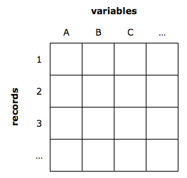
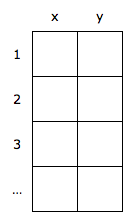

name: start
class: center, middle
background-image: url()

# Data Visualization
                
### ARGD 4080 / ARGD 4090 / ARST 7980

<https://datavis-sp16.github.io/>

---
class: center, middle

# Multidimensional Data

---
## variables = dimensions = columns  

  
2 dimensional (bivariate) data: 

---
## Encoding Univariate (1D) Data  

[http://www.datavizcatalogue.com/index.html](http://www.datavizcatalogue.com/index.html)

- bar chart  
- area chart  
- line graph (xy) / area graph  
- single stacked bar  
- pie chart (single stacked bar in circular form)  
- single box plot (statistical summary)  
- etc.

---
background-image: url(http://www.datavizcatalogue.com/methods/images/top_images/area_chart.png)

### area chart

---
background-image: url(http://www.datavizcatalogue.com/methods/images/top_images/area_graph.png) 

### area graph
 
---
background-image: url(http://www.datavizcatalogue.com/methods/images/anatomy/stacked_bar_graph.png)

### stacked bar chart

---
background-image: url(http://www.datavizcatalogue.com/methods/images/anatomy/box_plot.png)  

### Box Plot

---
## Encoding Bivariate (2D) Data  

- scatter plot  
- Clustered bar chart
- etc.

---
background-image: url(http://www.datavizcatalogue.com/methods/images/top_images/scatterplot.png)

### Scatterplot

---
## Encoding Trivariate (3D) Data (3D spatial encodins)

- 3D scatterplot (hard to see)  
- 3D surface plot   

---
background-image: url(http://www.statmethods.net/graphs/images/s3d1.png)

### 3D Scatterplot

---
background-image: url(http://i.stack.imgur.com/0hVjA.png)

### Surface Plot (with added color for redunancy)

---
### Non-spatial 3D encodings

Plotting 3D space on a 2D surface makes it hard to read data accurtely.  

Therefore, we give the 3rd variable (z) a non-spatial visual encoding:  
- hue / value (Ordinal) 
- size (area) 
- shape (Nominal)  
-  etc.

---
background-image: url(imagevariables.png)

---
## Encoding Multivariate (nD) Data: Non-spatial encodings

---
background-image: url(drinks.png)  

---
background-image: url(trellis.png) 

### Trellis Plots 
Subdivide the design space to compare multiple plots, usually with a nominal or ordinal variable used as the basis for subdividing the space. *Image credit: Jeff Heer*

---
background-image: url(mult.png) 

### Small Multples 
A generalization of the idea of a trellis plot. *MacEachren '95, Figure 2.11, p. 38*

---
background-image: url(https://3.bp.blogspot.com/-c5bDhQx8Y-w/TisWWy8s4kI/AAAAAAAAjkY/k-Af-OWK1t0/s1600/Rplot01.png)

### Scatterplot Matrix
Systematically plot  
all pairs of variables  
against each other.

---
background-image: url(https://stanford.edu/~mwaskom/software/seaborn/_images/scatterplot_matrix.png)

### Scatterplot matrix  
+ extra dimensions

---
background-image: url(views.png)

### multiple coordinated views

---
background-image: url(http://sdk.gooddata.com/gooddata-js/images/posts/parallel-coordinates.png)

### parallel coordinates

---
background-image: url(http://homes.cs.washington.edu/~jheer/files/zoo/parallel.png)

---
background-image: url(http://www.goldensoftware.com/newsletter_imgs/61/radar_graph_11.jpg)

### Radar Plot

---
background-image: url(http://www.visualcinnamon.com/wp-content/uploads/2015/09/D3-radar-chart-New-version.png)

---
background-image: url(http://tulip.labri.fr/TulipDrupal/sites/default/files/uploadedFiles/images/parallel_coordinates_circular_straight.preview.png)

---
background-image: url(http://bdtnp.lbl.gov/Fly-Net/content/bid/pcx/ParallelCoordinates/3DParallelCoordinates_Illustration.png)

---
background-image: url(http://www.excelcharts.com/blog/wp-content/uploads/2012/06/walmart-growth-micromaps1.png)

### More Small Multiples

---
background-image: url(http://blog.dominodatalab.com/content/images/2015/01/home_ownership.png)

---
background-image: url(http://sachi.cs.st-andrews.ac.uk/wp-content/uploads/2011/05/SmallMultiplesACHI_BEST_Paper.png)

---
background-image: url(http://flowingdata.com/wp-content/uploads/2011/07/When-crime-happens-625x330.png)

---
background-image: url(http://www.jessefagan.com/linksviz/gestalt.png)

[network visualization](http://www.jessefagan.com/linksviz/)

---
# Dimensionality Reduction

### Statistical Techniques:

- Principal Components Analysis (PCA)  
- Multidimensional Scaling (MDS)  
- Locally Linear Embedding (LLE)
- t-Dist. Stochastic Neighbor Embedding (t-SNE)  
- Isomap
- Auto-Encoder Neural Networks Topological methods
...

---
background-image: url(https://upload.wikimedia.org/wikipedia/en/f/f5/GaussianScatterPCA.svg)

### Principal Components Analysis (PCA)
[wikipedia](https://en.wikipedia.org/wiki/Principal_component_analysis)

---
# Strategies for nD visualization:

- Avoid encoding too many dimensions  
- Reduce the problem space
- Use small multiples established nD techniques  
- Use interaction, linked views, multiple views, etc.

Rarely does a single visualization answer all questions. Instead, the ability to generate appropriate visualizations quickly is key. 