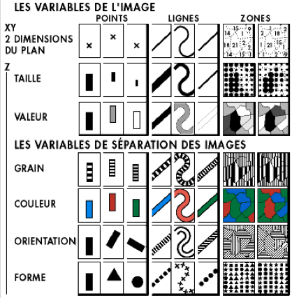
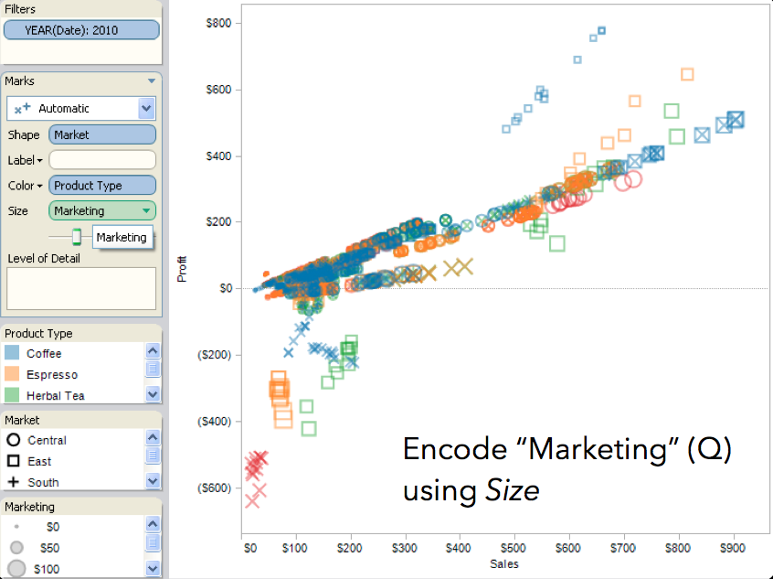
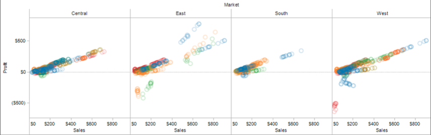
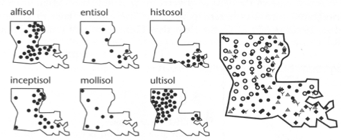
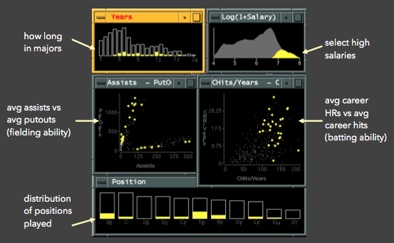

name: start
class: center, middle
background-image: url()

# Data Visualization
                
### ARGD 4080 / ARGD 4090 / ARST 7980

<https://datavis-sp16.github.io/>

---
class: center, middle

# Multidimensional Data

---
## variables = dimensions = columns  

 2 dimensional (bivariate) data: 

---
## Encoding Univariate (1D) Data  

[http://www.datavizcatalogue.com/index.html](http://www.datavizcatalogue.com/index.html)

- bar chart  
- area chart  

- line graph (xy) / area graph  
  
- single stacked bar  

- pie chart (single stacked bar in circular form)  
- single box plot (statistical summary)  
  
- etc.

---
## Encoding Bivariate (2D) Data  

- scatter plot  

- Clustered bar chart
- etc.

---
## Encoding Trivariate (3D) Data  

### Purely Spatial 3D encodings

- 3D scatterplot (hard to see)  

- 3D surface plot   

### Other 3D encodings

Plotting 3D space on a 2D surface makes it hard to read data accurtely.  

Therefore, we give the 3rd variable (z) a non-spatial visual encoding:  
- hue / value (Ordinal) 
- size (area) 
- shape (Nominal)  
-  etc.

---
## Encoding Multivariate (nD) Data

  
*Image credit: Jeff Heer*

---
### Trellis Plots 

A trellis plot subdivides the design space to compare multiple plots, usually with a nominal or ordinal variable used as the basis for subdividing the space.

 
*Image credit: Jeff Heer*

---
### Small Multiples

A generalization of the idea of a trellis plot:

*MacEachren '95, Figure 2.11, p. 38*

---
### Scatterplot Matrix

Systematically plot all pairs of variables against each other:

---
### Scatterplot matrix + extra dimensions

---
### multiple coordinated views

---
### parallel coordinates

---

---
### Radar Plot

---

---

---
### 3D parallel coordinates from series of scatterplots

---
background-image: url(http://www.excelcharts.com/blog/wp-content/uploads/2012/06/walmart-growth-micromaps1.png)

