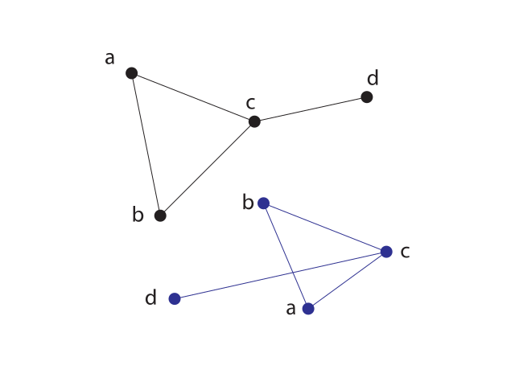

name: start
class: center, middle
background-image: url()

# Data Visualization
                
### ARGD 4080 / ARGD 4090 / ARST 7980

<https://datavis-sp16.github.io/>

---
class: center, middle

# Network Visualization

### ("Graphs")

---
class: left, top
                
.left-column[
### Graph Theory

The term **"Graph"** is used to mean a graphic representation of a network as a system of nodes (vertices) and edges (lines connecting nodes).  The term refers to [Graph Theory](https://en.wikipedia.org/wiki/Graph_theory).  (See also [Graph Drawing](https://en.wikipedia.org/wiki/Graph_drawing).

]	
.right-column-fat[
.width1[]

]

---
class: left, top
                
.left-column[
### Graph Theory

The layout of a graph (i.e. the positions of the vertices, and the lengths and angles of the edges) *often* is not meaningful.  Graphs that differ only in their layout are considered **"isomorphic"** (That is, they have the same structure.)

Good graph design requires determining a layout that will best reveal a given structure.

]	
.right-column-fat[
.width1[]

]

---
class: left, top
                
.left-column[
### Layouts

Many software tools for drawing graphs allow the designer to specify layout methods by name.  Here are a few common layouts:

]	
.right-column-fat[

**[Circular Layout](https://en.wikipedia.org/wiki/Circular_layout)**  
Nodes are aranged in a circle.  Good for showing [star](https://en.wikipedia.org/wiki/Star_network) or [ring](https://en.wikipedia.org/wiki/Ring_networks) networks.

.width2[]

]

---
class: left, top
                
.left-column[
### Layouts

Many software tools for drawing graphs allow the designer to specify layout methods by name.  Here are a few common layouts:

]	
.right-column-fat[

**[Layered or Hierarchical Graph](https://en.wikipedia.org/wiki/Layered_graph_drawing)**  
Nodes are aranged in rows indicating rank in a heirarchy.

.width1[]

]

---
class: left, top
                
.left-column[
### Layouts

Many software tools for drawing graphs allow the designer to specify layout methods by name.  Here are a few common layouts:

]	
.right-column-fat[

**[Arc diagram](https://en.wikipedia.org/wiki/Arc_diagram)**  
Nodes are aranged along a single straight line, with edges drawn as semicircles.  Among the possible applications are showing conenctions bewteen nodes on a timeline.  

.width2[]

]

---
class: left, top
                
.left-column[
### Layouts

Many software tools for drawing graphs allow the designer to specify layout methods by name.  Here are a few common layouts:

]	
.right-column-fat[

**[Force Directed Layout](https://en.wikipedia.org/wiki/Force-directed_graph_drawing)**  
Uses an algorithms to position the nodes of a graph in two-dimensional or three-dimensional space, optimizing the positions to meet the following criteria:

* equalize edge lengths  
* minimize the number of edge crossings 

The algorithms work by assigning "forces" to nodes and edges, based on their relative positions, then simulating the physics of their motion of nodes and edges until an optimal layout is reached.

.width2[]

[https://bl.ocks.org/mbostock/raw/4062045/](https://bl.ocks.org/mbostock/raw/4062045/)

]

