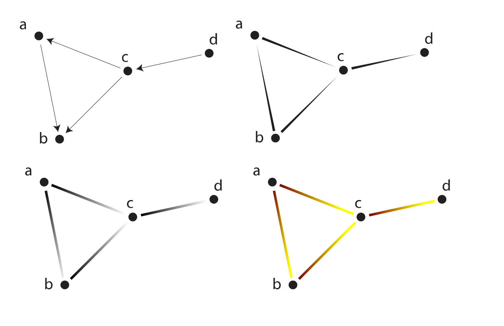

name: start
class: center, middle
background-size: contain  
background-image: url()

# Data Visualization
                
### ARGD 4080 / ARGD 4090 / ARST 7980

<https://datavis-sp16.github.io/>

---
class: center, middle

# Network Visualization

### ("Graphs")

---
class: left, top
                
.left-column[
### Graph Theory

The term **"Graph"** is used to mean a graphic representation of a network as a system of nodes (vertices) and edges (lines connecting nodes).  The term refers to [Graph Theory](https://en.wikipedia.org/wiki/Graph_theory).  (See also [Graph Drawing](https://en.wikipedia.org/wiki/Graph_drawing).

]	
.right-column-fat[
.width1[]

]

---
class: left, top
                
.left-column[
### Graph Theory

The layout of a graph (i.e. the positions of the vertices, and the lengths and angles of the edges) *often* is not meaningful.  Graphs that differ only in their layout are considered **"isomorphic"** (That is, they have the same structure.)

Good graph design requires determining a layout that will best reveal a given structure.

]	
.right-column-fat[
.width1[]

]

---
class: left, top
                
.left-column[
### Layouts

Many software tools for drawing graphs allow the designer to specify layout methods by name.  Here are a few common layouts:

]	
.right-column-fat[

**[Circular Layout](https://en.wikipedia.org/wiki/Circular_layout)**  
Nodes are aranged in a circle.  Good for showing [star](https://en.wikipedia.org/wiki/Star_network) or [ring](https://en.wikipedia.org/wiki/Ring_networks) networks.

.width2[]

]

---
class: left, top
                
.left-column[
### Layouts

Many software tools for drawing graphs allow the designer to specify layout methods by name.  Here are a few common layouts:

]	
.right-column-fat[

**[Layered or Hierarchical Graph](https://en.wikipedia.org/wiki/Layered_graph_drawing)**  
Nodes are aranged in rows indicating rank in a heirarchy.

.width1[]

]

---
class: left, top
                
.left-column[
### Layouts

Many software tools for drawing graphs allow the designer to specify layout methods by name.  Here are a few common layouts:

]	
.right-column-fat[

**[Arc diagram](https://en.wikipedia.org/wiki/Arc_diagram)**  
Nodes are aranged along a single straight line, with edges drawn as semicircles.  Among the possible applications are showing conenctions bewteen nodes on a timeline.  

.width2[]

]

---
class: left, top
                
.left-column[
### Layouts

Many software tools for drawing graphs allow the designer to specify layout methods by name.  Here are a few common layouts:

]	
.right-column-fat[

**[Force Directed Layout](https://en.wikipedia.org/wiki/Force-directed_graph_drawing)**  
Uses an algorithms to position the nodes of a graph in two-dimensional or three-dimensional space, optimizing the positions to meet the following criteria:

* equalize edge lengths  
* minimize the number of edge crossings 

The algorithms work by assigning "forces" to nodes and edges, based on their relative positions, then simulating the physics of their motion of nodes and edges until an optimal layout is reached.

.width2[]

[https://bl.ocks.org/mbostock/raw/4062045/](https://bl.ocks.org/mbostock/raw/4062045/)

]

---
class: left, top
                
.left-column[
### Encoding additional information

In addition to the basic structure of a graph (which nodes are connected to which other nodes), a graph may encode additional data about the nodes or about the connections.

<mark>**Nodes**</mark>

Quantitative
Nominal (category)
Ordinal (order or rank)
etc.

**Edges**

Directed/Undirected  
Weighted (Quantitative or ordinal)  
Nominal  

]	
.right-column-fat[

Quantitative, Nominal or Ordinal data about a node can be encoded in the size, shape, color, etc. of a node, just as in a scatter plot or bubble chart.  Limited only by imagination.  A node could even be a pie chart representing complex data internal to the node...  

.width3[]

.width3[]
  
.width3[]

.width3[]

]

---
class: left, top
                
.left-column[
### Encoding additional information

In addition to the basic structure of a graph (which nodes are connected to which other nodes), a graph may encode additional data about the nodes or about the connections.

**Nodes**

Quantitative
Nominal (category)
Ordinal (order or rank)
etc.

<mark>**Edges**</mark>

Directed/Undirected  
Weighted (Quantitative or ordinal)  
Nominal  

]	
.right-column-fat[

Edges may be undirected (showing only which nodes are connected) or [directed](https://en.wikipedia.org/wiki/Directed_graph), with the direction of the connection encoded as arrows, color. etc..

.width1[] 

]

---
class: left, top
                
.left-column[
### Encoding additional information

In addition to the basic structure of a graph (which nodes are connected to which other nodes), a graph may encode additional data about the nodes or about the connections.

**Nodes**

Quantitative
Nominal (category)
Ordinal (order or rank)
etc.

<mark>**Edges**</mark>

Directed/Undirected  
Weighted (Quantitative or ordinal)  
Nominal  

]	
.right-column-fat[

Edges may be [weighted](https://en.wikipedia.org/wiki/Directed_graph), showing the strength or magnitude of each connection, with weight encoded as stroke width, color, etc.

.width1[] 

Edges can encode nominal data as well, using color, stroke style, etc.

]

---
class: left, top
                
.left-column[
### Data
]

.right-column-fat[

Data for a network graph is stored in two data tables: one for nodes, and one for edges.  A minimal graph (unweighted, undireted) has simple data tables simply listing nodes and listing connections (as pairs of nodes):

Nodes  
a  	
b  
c  
d  

Edges  
a b  
a c  
b c  
c d  
]

---
class: left, top
                
.left-column[
### Data
]

.right-column-fat[

Additional data about the nodes or edges are stored in the same tables.  Here is example data for the ocean-atmosphere carbon cycle:

Nodes  

Edges

]

---
class: left, top
                
.left-column[
### Tools
]

.right-column-fat[

Software tools for making graphs are numerous.  Some are built in to general datavis tols, like D3 and Vega.  Others are standalone applications or libraries.  Asside from the D3 and Vega implementations, here are just a few others: 

**Applications**

* [Gephi](gephi.org)  
* [Cytoscape](http://cytoscape.org/)

Both Gephi and Cytoscale are powerful, producing highly customizable graphs.  

**Libraries**

[cytoscape.js](http://js.cytoscape.org/) is a JavaScript implementation of cytoscape.  Very powerful and realtively easy to use; Declarative, using json format.  Requires little knowledge of Javascript.  

[igraph](http://igraph.org/) is a library for R, python or C.  Also declarative, powerful and fairly easy.
]

---
class: left, top
                
.left-column[
### Tools
]

.right-column-fat[

**Workflow**

Most graph drawing tools will not offer all the features you might want.  For a simple graph with a static layout and not too many nodes, you can do the initial encoding, layout and styling in an application or library, then export to SVG for further work in Illustrator or other vector drawing program.  For complex graphs with hundreds of nodes, however, you have to do your best with the graph applications and libraries.

]

---
class: center, middle
                
### Carbon Cycle figure

(offline)

### Cytoscape.js demo

(offline)
