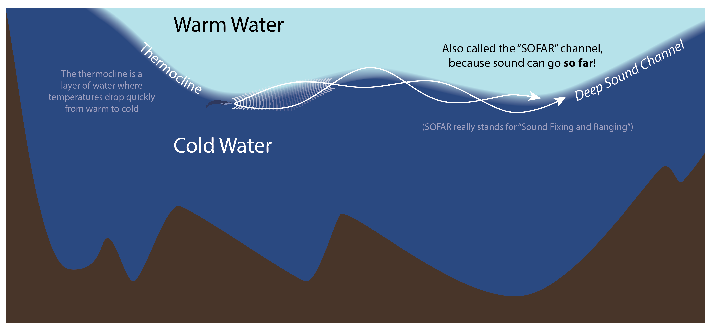

Soundscape.

What's in our soundscape? Listen? Clean your ears.  What's a natural sound, what's a human-made sound?

This is what we hear in the ocean.

[]

# Who Makes Sound? 

The ocean is a world of sound.  

There is very little light below 200 m (650 feet).  Below that is the **Twilight Zone**, down to 3000 ft (1000m), with practically no light. Below _**that**_ is the **Midnight Zone**.  No light at all, unless you make your own little specs of light, like Lantern fish.

### But how far can you really see? ...in the Sea? How far do you think you can see? 

ANSWER: You can only see 150ft - 250 ft, even in the cleareast waters.  Maybe only 40 or 50 feet in coastal waters, where the water is cloudier.

### How far does sound travel under water? How far away can you HEAR something?

ANSWER: Pretty far! (thousands of km)

* Sound travels about 100 times farther in water than in air.  How far can you hear me shouting? A block away?  How about 100 blocks?

But wait, there's more...

PVC Tube

So, Thousands of km!

So, Sound is a REALLY good wat to communicate underwater.

# Why do they make it?

### For fun? 

<iframe width="100%" height="450" scrolling="no" frameborder="no" src="https://w.soundcloud.com/player/?url=https%3A//api.soundcloud.com/tracks/236090056&amp;auto_play=false&amp;hide_related=false&amp;show_comments=true&amp;show_user=true&amp;show_reposts=false&amp;visual=true"></iframe>

### Communication  

Blue Whale deep rumble

<https://scripps.ucsd.edu/labs/sirovic/>

Minke Whale Boing
Minke Whale Pulse Train

Fish do it too.  Not just Marine Mammals!

* Bocaccio  (rockfish species found in the Southern California Bight)

* Atlantic Midshipman  
(Very vocal toadfish species. They are common in the Atlantic and along the Gulf of Mexico.)

* Nassau Grouper  
(Very large, very vocal species of grouper in the Caribbean; have suffered from extensive overfishing; they spawn in large aggregations at predictable places and times, so easy to fish.)

* Red Hind Grouper  
(Another very vocal species of grouper.)

* Mystery Fish of the Gulf of Mexico

* Mystery Fish 2: Pogo Styck Fish (

### Echoloation - SSONAR - Seeing the world with sound  
### Death Rays  

## Anthropogenic Noise

Sonic Sea trailer

## Soundscapes: What does the environment sound like in the…
	- near shore
	- deep sea
	- mariana trench
	- etc.

## Listen Live

	Listen to a live feed (LIDO), listen for

