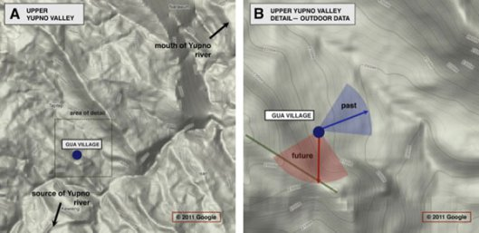
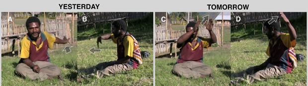
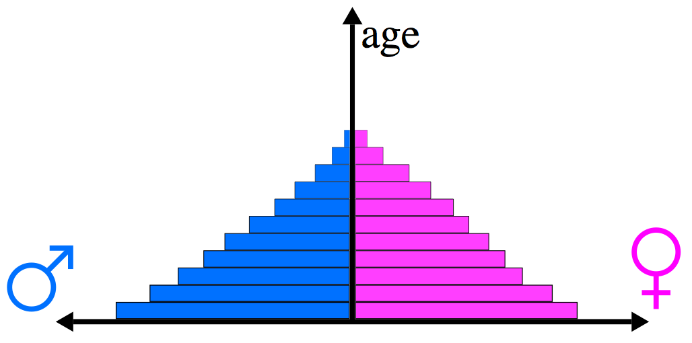

name: start
class: center, middle
background-image: url()

# Data Visualization
                
### ARGD 4080 / ARGD 4090 / ARST 7980

<https://datavis-sp16.github.io/>

---
class: center, middle

# Time

---
class: top, left

.left-column[
### Temporal Design  

* <mark>Spatial Mappings for Time</mark>  
* Metaphors for Time  
* Graphic Scores

]	

.right-column-fat[

Many (though not all) of the principles of 2D and 3D visual design and composition can be applied to the visualization of time-based phenomena or to the design of time-based media, by **imagining or mapping time to a physical dimension**.  

**Cross-domain mapping:** Thinking of one set of phenomena in terms of another set of phenomena. Imagining time as a physical dimension is an example of this.

It is probably easiest to think of time as the horizontal dimension, (map time to the **x** axis).  Equipped with this spatial metaphor for time, you can imagine how a concept from 2D design like “line” is applied to time.

]

---
background-image: url(http://i.imgur.com/ycJetYr.png)

---
class: top, left

.left-column[
### Temporal Design  

* Spatial Mappings for Time  
* <mark>Metaphors for Time</mark>  
* Graphic Scores

]	

.right-column-fat[

Concepts of time flowing forward, flowing left-to-right, etc. are **culturally acquired spatial metaphors**.   

Most common metaphor for time in Western culture: 

* future = in front 
* past = behind  

This is reflected in our Western languages, in phrase like, “Your future lies ahead of you,” as well as in our non-verbal gestures. 

This may seem counter-intuitive, but time flowing forward is not a universal concept.  Time flowing forward was once thought by Western thinkers to be universal, an example of "[embodied cognition](https://en.wikipedia.org/wiki/Embodied_cognition)," that is a mental process determined by the form of the human body.  It is now understood to be cultural.

]

---
class: top, left

.left-column[
### Temporal Design  

* Spatial Mappings for Time  
* <mark>Metaphors for Time</mark>  
* Graphic Scores

]	

.right-column-fat[

### Body-centric spatial metaphors for time from non-western cultures:

**Aymara**

* future = behind  
* past = in front

The Aymara people of the Andes think of the past as in front (because it can be seen), while the future is not see-able, therefore behind.
**Mandarin**  

* future = below  
* past = above

]

---
class: top, left

.left-column[
### Temporal Design  

* Spatial Mappings for Time  
* <mark>Metaphors for Time</mark>  
* Graphic Scores

]	

.right-column-fat[

### Geographical spatial metaphors for time from non-western cultures:

**Pormpuraawan** 

* past = East  
* future = West  

For the Pormpuraawans in Autralia, the past is in the east and the future is in the west, following the path of the sun.

**Yupno**

* past = downhill  
* future = uphill  

For the Yupno people of Papua New Guinea, the past is downhill, and the future is uphill, perhaps reflecting ancestral migrations from the coastal lowlands up the mountain valleys.  

]

---
class: top, left

.left-column[
### Temporal Design  

* Spatial Mappings for Time  
* <mark>Metaphors for Time</mark>  
* Graphic Scores

]	

.right-column-fat[

### Geographical spatial metaphors for time from non-western cultures:

**Yupno**

* past = downhill  
* future = uphill  

Gestures used when speaking reflect this internal metaphor. Speakers always gesture downhill when talking about the past, and uphill when talking about the future.

Inside a Yupno house, which is raised above the ground, speakers always point towards the doorway when talking about the past (because you step down through the door), and away from the door to represent the future.

<small>Reference: [Kambiz Kamrani: *The Uphill Climb of Time for the Yupno of Papua New Guinea*](https://anthropology.net/2012/06/01/the-uphill-climb-of-time-for-the-yupno-of-papua-new-guinea/)</small>
]

---
class: top, left

.left-column[
### Temporal Design  

* Spatial Mappings for Time  
* <mark>Metaphors for Time</mark>  
* Graphic Scores

]	

.right-column-fat[

### Alternate spatial metaphors for time in western culture:

* past = left  
* future = right  

Westerners often conceive of time as flowing left to right, influenced by the left-to-right writing and reading.  This is the norm in most visualizations using time.

* past = top  
* future = bottom  

.width2[]  

*A combination of top-to-bottom, left-to-right, and cyclical meaphors.*

* past = bottom  
* future = top  

.width2[]

---
class: top, left

.left-column[
### Temporal Design  

* Spatial Mappings for Time  
* <mark>Metaphors for Time</mark>  
* Graphic Scores

]	

.right-column-fat[

### Cyclical concepts of time:

