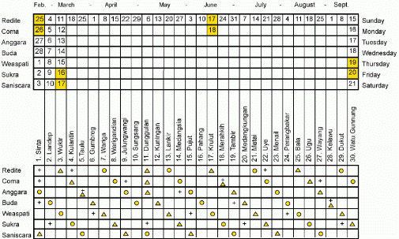
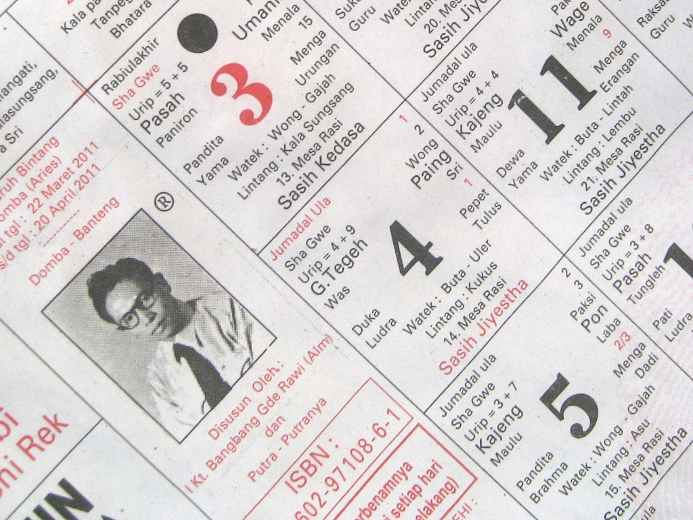

name: start
class: center, middle
background-image: url()

# Data Visualization
                
### ARGD 4080 / ARGD 4090 / ARST 7980

<https://datavis-sp16.github.io/>

---
class: center, middle

# Time

---
class: left, top
                
.left-column[
### Temporal Design  

* <mark>Spatial Mappings for Time</mark>  
* Metaphors for Time  
* Graphic Scores

]	

.right-column-fat[

Many (though not all) of the principles of 2D and 3D visual design and composition can be applied to the visualization of time-based phenomena or to the design of time-based media, by **imagining or mapping time to a physical dimension**.  

**Cross-domain mapping:** Thinking of one set of phenomena in terms of another set of phenomena. Imagining time as a physical dimension is an example of this.

It is probably easiest to think of time as the horizontal dimension, (map time to the **x** axis).  Equipped with this spatial metaphor for time, you can imagine how a concept from 2D design like “line” is applied to time.

]

---
class: left, top  
background-image: url(http://i.imgur.com/ycJetYr.png)

---
class: left, top
                
.left-column[
### Temporal Design  

* Spatial Mappings for Time  
* <mark>Metaphors for Time</mark>  
* Graphic Scores

]	

.right-column-fat[

Concepts of time flowing forward, flowing left-to-right, etc. are **culturally acquired spatial metaphors**.   

Most common metaphor for time in Western culture: 

* future = in front 
* past = behind  

This is reflected in our Western languages, in phrase like, “Your future lies ahead of you,” as well as in our non-verbal gestures. 

This may seem counter-intuitive, but time flowing forward is not a universal concept.  Time flowing forward was once thought by Western thinkers to be universal, an example of "[embodied cognition](https://en.wikipedia.org/wiki/Embodied_cognition)," that is a mental process determined by the form of the human body.  It is now understood to be cultural.
]

---
class: left, top
                
.left-column[
### Temporal Design  

* Spatial Mappings for Time  
* <mark>Metaphors for Time</mark>  
* Graphic Scores
]	

.right-column-fat[
### Body-centric spatial metaphors for time from non-western cultures:

**Aymara**

* future = behind  
* past = in front

The Aymara people of the Andes think of the past as in front (because it can be seen), while the future is not see-able, therefore behind.
**Mandarin**  

* future = below  
* past = above
]

---
class: left, top
                
.left-column[
### Temporal Design  

* Spatial Mappings for Time  
* <mark>Metaphors for Time</mark>  
* Graphic Scores

]	

.right-column-fat[

### Geographical spatial metaphors for time from non-western cultures:

**Pormpuraawan** 

* past = East  
* future = West  

For the Pormpuraawans in Autralia, the past is in the east and the future is in the west, following the path of the sun.

**Yupno**

* past = downhill  
* future = uphill  

For the Yupno people of Papua New Guinea, the past is downhill, and the future is uphill, perhaps reflecting ancestral migrations from the coastal lowlands up the mountain valleys.  

]

---
class: left, top
                
.left-column[
### Temporal Design  

* Spatial Mappings for Time  
* <mark>Metaphors for Time</mark>  
* Graphic Scores

]	

.right-column-fat[

### Geographical spatial metaphors for time from non-western cultures:

**Yupno**

* past = downhill  
* future = uphill  

Gestures used when speaking reflect this internal metaphor. Speakers always gesture downhill when talking about the past, and uphill when talking about the future.

Inside a Yupno house, which is raised above the ground, speakers always point towards the doorway when talking about the past (because you step down through the door), and away from the door to represent the future.

<small>Reference: [Kambiz Kamrani: *The Uphill Climb of Time for the Yupno of Papua New Guinea*](https://anthropology.net/2012/06/01/the-uphill-climb-of-time-for-the-yupno-of-papua-new-guinea/)</small>
]

---
class: left, top
                
.left-column[
### Temporal Design  

* Spatial Mappings for Time  
* <mark>Metaphors for Time</mark>  
* Graphic Scores

]	

.right-column-fat[

### Alternate spatial metaphors for time in western culture:

* past = left  
* future = right  

Westerners often conceive of time as flowing left to right, influenced by the left-to-right writing and reading.  This is the norm in most visualizations using time.

* past = top  
* future = bottom  

.width2[]  

*A combination of top-to-bottom, left-to-right, and cyclical meaphors.*

* past = bottom  
* future = top  

.width2[]
]

---
class: left, top
                
.left-column[
### Temporal Design  

* Spatial Mappings for Time  
* <mark>Metaphors for Time</mark>  
* Graphic Scores

]	

.right-column-fat[

### Cyclical concepts of time:

Most cultures seem to have cyclical concepts of time as well as linear ones, but the relative importance of cyclical and linear notions of time vary from culture to culture.

Western culture has daily, weekly, hourly, yearly cycles that we superimpose on our forward-directed linear concept of time. 

**Balinese Wuku Calendar**

For the Balinese, cycles are more important to their conception of time than in Western culture.

.width2[]

The Balinese “Pawukon” or “[Wuku](http://en.wikipedia.org/wiki/Pawukon_calendar)” calendar features complex interactions of simultaneous cycles.  Each day has ten names, each day name belonging to a named cycle of a different length from 1 to 10 days.  The meta-cycle repeats every 210 days.  

]

---
class: left, top  
background-image: url(02.4-Wuku.gif)

---
class: left, top
                
.left-column[
### Temporal Design  

* Spatial Mappings for Time  
* <mark>Metaphors for Time</mark>  
* Graphic Scores

]	

.right-column-fat[

### Cyclical concepts of time:

**Balinese Wuku Calendar**

Balinese wall calendars display the complex of Pawukon day names along with months, day numbers and lunar phases from the lunar “Saka” calendar, Bali’s other main calendar, as well as Indonesian holidays and important days from various religions.

.width2[]

In Bali, time cycles are seen as hierarchical, embedded, extending from the very largest ceremonial cycle of 7 years down through the Pawukon to the shortest cycles in a musical composition.  

In the 210 day Wuku calendar, cycles are marked but not counted.  Time simply flows around in circles. Crucially, the concept of beginning and end are not strong. Pieces of music don’t really begin or end, but rather come into alignment with a cycle.

]

---
class: left, top
                
.left-column[
### Temporal Design  

* Spatial Mappings for Time  
* Metaphors for Time  
* <mark>Graphic Scores</mark>

]	

.right-column-fat[

**Timeline**

The timeline is a simple graph of placement of events in time.

**Time Series**

Time-series charts show time on one axis and map time-dependent variables to the y axis and other visual mappings.

**Graphic Score**

A graphic "score" is a term borrowed from music notation.  It is essentially a time series chart wih aspects of a timeline.  A graphic score can be data-accurate, or merely descriptive.  Creating a graphic score cn be a means to analyze time-based artworks or time-based phenomena.

]

---
class: left, top
                
.left-column[
### Temporal Design  

* Spatial Mappings for Time  
* Metaphors for Time  
* <mark>Graphic Scores</mark>

]	

.right-column-fat[

**Example: video graphic score**

Time-dependent variables:

* amount of motion on screen
* pace of cutting  
* number of cahracters on screen  
* luminosty  
* hue  
* etc.

These could be mapped to y position, stroke, color, texture, shape, etc.

This method has been used by composers of electroacoustic music and sound designers, who often prepare a graphic score to aid in designing the form of the work. It can be used in conjunction with story boarding to clarify or design the form of a time-based work.  It can also be used to analyze existing works to derive insights about their temporal design.

---
class: left, top
                
.left-column[
### Temporal Design  

* Spatial Mappings for Time  
* Metaphors for Time  
* <mark>Graphic Scores</mark>

]	

.right-column-fat[

By thinking carefully about what to plot against time, you can create a canvas in which principals of 2-D design can be applied to the design of time-based art. For example:

* Horizontal structures create a sense of stability.
* Repetitive patterns create a sense of order, stability, security. 
* A linear arrangement of elements moving from the lower left-hand corner of the “canvas” to the upper right, will generally create a sense of lift, upward motion, increasing tension.  
* A linear arrangement along the other diagonal (upper left to lower right) will generally create a sense of downward motion, coming to rest, release of tension.  
* Repetition creates continuity “follow” the composition and make sense of it.  
* Irregularity creates a sense of confusion, a sense of being lost. 

*Note: PERFECT REGULARITY creates a sense of mechanical artificiality, monotony, and unnaturalness. While we can be strongly attracted to repetitive patterns, we are often repelled by patterns that are perfectly regular.*

]

---
class: left, bottom
background-image: url(03-Ligeti-Arikulation.jpg)

<small>Gyorgy Ligeti's *Artikulation* (1958). Visual listening score by Rainer Wehinger.</small>

---
class: center, middle

[Artikulation (animated)](http://www.youtube.com/watch?v=71hNl_skTZQ&feature=related)

---
class: left, bottom  
background-image: url(04-stripsody.jpg)

<small>Cathy Berberian's *Stripsody* (1966).  Performance score.</small>

---
class: center, middle

[Stripsody (video)](http://www.youtube.com/watch?v=0dNLAhL46xM)

---
class: left, bottom    
background-image: url(05-RunLolaRun.png)

<small>Meenakshi Borgohain: Graphic representation of *Run Lola Run* (Tom Tykwer, 1998 German). Project @ SAIC directed by Lu Jingren
</small>

---
class: left, bottom    
background-image: url(06-RunLolaRun.png)

<small>Meenakshi Borgohain: Graphic representation of *Run Lola Run* (Tom Tykwer, 1998 German). Project @ SAIC directed by Lu Jingren. More graphic scores for *Run Lola Run* [here](https://www.behance.net/gallery/549882/Run-Lola-Run) and [here](https://www.behance.net/gallery/451813/Run-Lola-Run-Visualization)</small>
]
